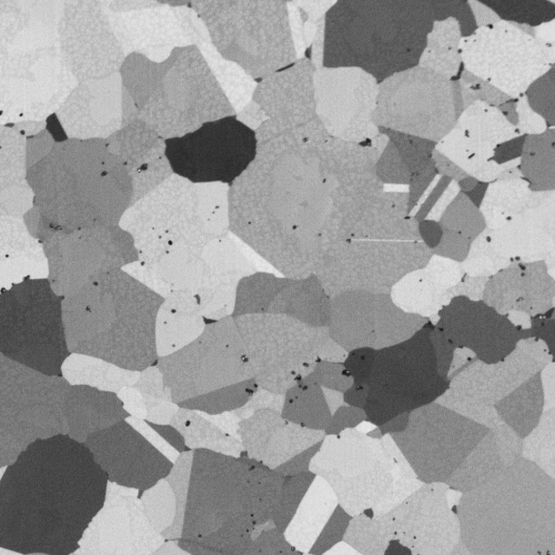
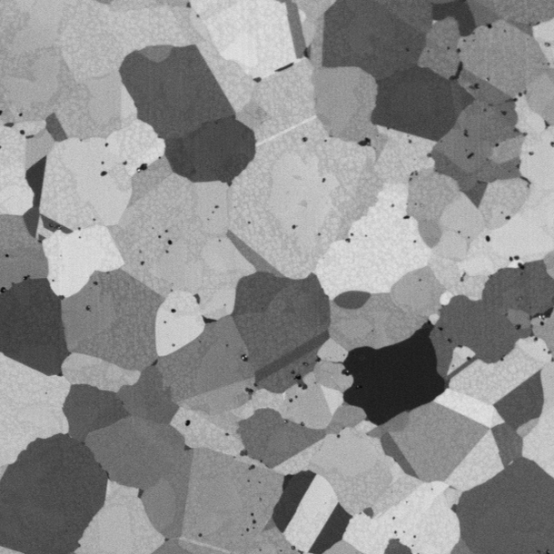
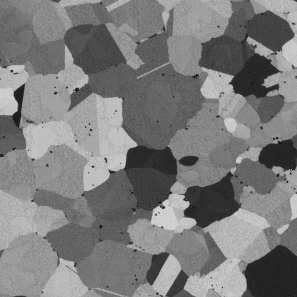
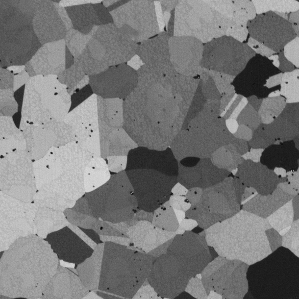

# Import Image Stack Filter #

## Group (Subgroup) ##

IO (Input)

## Description ##

This filter imports a 3D Stack of images in specially numbered sequences so that the 
resulting data has multiple components at each pixel. This might be handy if the
user has RGB data where each channel is in a separate file. This filter is also
handy for SEM _multi-tilt_ series of images that need to be segmented.

For example a file set with the following names:

    Small_IN100_1-0.tiff
    Small_IN100_1-1.tiff
    Small_IN100_1-2.tiff
    Small_IN100_1-3.tiff

which comes from an SEM Multi-Tilt series data set can be explained as follows.

| Path | File Prefix | Slice Index | Separator | Component Index | File Suffixe | File Extension |
|------|-------------|-------------|-----------|-----------------|--------------|----------------|
| /Some/Path | Small_IN100 | 1 | - | 0 | | tiff |
| /Some/Path | Small_IN100 | 1 | - | 1 | | tiff |
| /Some/Path | Small_IN100 | 1 | - | 2 | | tiff |
| /Some/Path | Small_IN100 | 1 | - | 3 | | tiff |

From this example the data set would have an ImageGeometry with a size of 610 x 610 x 1 (X, Y, Z) and the Cell data would be unsigned 8 bit char x 4 components where each component represents a specific tilt in the series.

## Notes

8 Bit and 16 bit images (Both color and grayscale should be valid inputs). **Color
images __will__ be converted to grayscale via the luminosity algorithm or just
the first channel of the RGB array can be used. The final array MUST essentially
be a multi-component grayscale image.**

## Parameters ##

| Name             |  Type  |
|------------------|--------|
| Input File List | VectorFileListInfo type |
| Origin | float x 3 |
| Resolution | float x 3 |
| Convert Color To Grayscale | Bool |
| Data Container Name | String |
| Cell Attribute Matrix Name | String |
| Vector Data Array Name | String |

## Required DataContainers ##

NONE

## Required Objects ##

NONE

## Created Objects ##

| Kind | Default Name | Type | Component Dimensions | Description |
|------|--------------|------|----------------------|-------------|
| **Data Container** | Data Container Name | N/A | N/A |  |
| ImageGeometry |  | N/A | N/A |  |
| Cell AttributeMatrix |  | N/A | N/A |  |
| VectorData |  | N/A | N/A |  |

## Authors ##

**Contact Info** dream3d@bluequartz.net

**Version** 1.0.0

**License**  See the License.txt file that came with DREAM3D.

## Example Pipelines ##

## License & Copyright ##

Please see the description file distributed with this **Plugin**

## DREAM.3D Mailing Lists ##

If you need more help with a **Filter**, please consider asking your question on the [DREAM.3D Users Google group!](https://groups.google.com/forum/?hl=en#!forum/dream3d-users)

