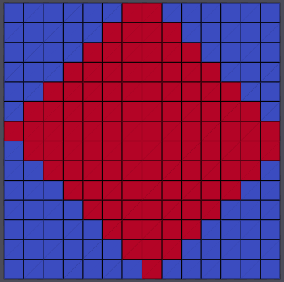

================================
Apply Transformation to Geometry
================================

Group (Subgroup)
================

Rotation & Transformation

Description
===========

This **Filter** applies a spatial transformation to either and unstructured **Geometry** or an ImageGeometry. An ”
unstructured” **Geometry** is any geometry that requires explicit definition of **Vertex** positions. Specifically,
Vertex\ **,** Edge\ **,** Triangle\ **,** Quadrilateral\ **, and** Tetrahedral*\* **Geometries** may be transformed by
this Filter\ **. The transformation is applied in place, so the input** Geometry*\* will be modified.

If the user selects an **Image Geometry** then they will need to select which kind of \**Interpolation Method\* will be
used when transferring the data from the old geometry to the newly transformed geometry.

The linear/Bi-Linear/Tri-Linear Interpolation is adapted from the equations presented in
`https://www.cs.purdue.edu/homes/cs530/slides/04.DataStructure.pdf, page
36} <https://www.cs.purdue.edu/homes/cs530/slides/04.DataStructure.pdf>`__

Caveats
-------

If the user selects an **unstructured** based geometry, **NO** interpolation will take place as the only changes that
take place are the actual coordinates of the vertices.

If the user selects an **Image Geometry** then the user should select one of the *Interpolation* methods and then also
select the appropriate *Cell Attribute Matrix*.

The **Scale** and **Rotation** transformation types will automatically translate the volume to (0, 0, 0), apply the
scaling/rotation, and then translate the volume back to its original location. If the **Manual Transformation Matrix**
or **Pre-Computed Transformation Matrix** types are selected, then it is up to the user to make sure that those
translations are included, if necessary.

Example Transformations
=======================

================================== ====================
Description                        Example Output Image
================================== ====================
Untransformed                      |image1|
After Rotation of <001> 45 Degrees |image2|
Scaled (2.0, 2.0, 1.0)             |image3|
================================== ====================

Transformation Information
==========================

The user may select from a variety of options for the type of transformation to apply:

+---------+-------------------------------+----------------------------------------------------------------------------+
| Enum    | Transformation Type           | Representation                                                             |
| Value   |                               |                                                                            |
+=========+===============================+============================================================================+
| 0       | No Transformation             | Identity transformation                                                    |
+---------+-------------------------------+----------------------------------------------------------------------------+
| 1       | Pre-Computed Transformation   | A 4x4 transformation matrix, supplied by an **Attribute Array** in *row    |
|         | Matrix                        | major* order                                                               |
+---------+-------------------------------+----------------------------------------------------------------------------+
| 2       | Manual Transformation Matrix  | Manually entered 4x4 transformation matrix                                 |
+---------+-------------------------------+----------------------------------------------------------------------------+
| 3       | Rotation                      | Rotation about the supplied axis-angle <x,y,z> (Angle in Degrees).         |
+---------+-------------------------------+----------------------------------------------------------------------------+
| 4       | Translation                   | Translation by the supplied (x, y, z) values                               |
+---------+-------------------------------+----------------------------------------------------------------------------+
| 5       | Scale                         | Scaling by the supplied (x, y, z) values                                   |
+---------+-------------------------------+----------------------------------------------------------------------------+

Parameters
==========

+--------------------------------+------+------------------------------------------------------------------------------+
| Name                           | Type | Description                                                                  |
+================================+======+==============================================================================+
| Transformation Type            | Enu  | Type of transformation to be used. (0-5)                                     |
|                                | mera |                                                                              |
|                                | tion |                                                                              |
+--------------------------------+------+------------------------------------------------------------------------------+
| Transformation Matrix          | f    | Entries of the 4x4 transformation matrix, if *Manual* is chosen for the      |
|                                | loat | *Transformation Type*                                                        |
|                                | (    |                                                                              |
|                                | 4x4) |                                                                              |
+--------------------------------+------+------------------------------------------------------------------------------+
| Rotation Axis-Angle (ijk)      | f    | axis-angle <x,y,z> (Angle in Degrees)                                        |
|                                | loat |                                                                              |
|                                | (4x) |                                                                              |
+--------------------------------+------+------------------------------------------------------------------------------+
| Translation                    | f    | (x, y, z) translation values, if *Translation* is chosen for the             |
|                                | loat | *Transformation Type*                                                        |
|                                | (3x) |                                                                              |
+--------------------------------+------+------------------------------------------------------------------------------+
| Scale                          | f    | (x, y, z) scale values, if *Scale* is chosen for the *Transformation Type*   |
|                                | loat |                                                                              |
|                                | (3x) |                                                                              |
+--------------------------------+------+------------------------------------------------------------------------------+
| Translate Geometry To Global   | boo  | If enabled, translates the geometry to (0, 0, 0), applies the                |
| Origin Before Transformation   | lean | transformation, and then translates the geometry back to its original        |
|                                |      | origin.                                                                      |
+--------------------------------+------+------------------------------------------------------------------------------+
| Precomputed Transformation     | Data |                                                                              |
| Matrix Data Path               | Path |                                                                              |
+--------------------------------+------+------------------------------------------------------------------------------+
| Geometry to be transformed.    | Data |                                                                              |
|                                | Path |                                                                              |
+--------------------------------+------+------------------------------------------------------------------------------+

Image Geometry Transformation Options
-------------------------------------

========== =========================================
Enum Value Interpolation Type
========== =========================================
0          No Interpolation
1          Nearest Neighbor
2          Linear/Bi linear/Tri linear Interpolation
========== =========================================

===================== =========== ======================================================
Name                  Type        Description
===================== =========== ======================================================
Interpolation Type    Enumeration Type of Interpolation to be used. (0-2)
Cell Attribute Matrix DataPath    The path to the Image Geometry’s Cell Attribute Matrix
===================== =========== ======================================================

Required Geometry
=================

Any **Unstructured Geometry** or **Image Geometry**

Required Objects
================

+------------+--------+------+--------+-------------------------------------------------------------------------------+
| Kind       | D      | Type | Comp   | Description                                                                   |
|            | efault |      | Dims   |                                                                               |
|            | Name   |      |        |                                                                               |
+============+========+======+========+===============================================================================+
| Geometry   | None   | N/A  | N/A    | The unstructured **Geometry** or Image Geometry to transform                  |
+------------+--------+------+--------+-------------------------------------------------------------------------------+
| DataArray  | Tr     | f    | 4x4    | The pre-computed transformation matrix to apply, if *Pre-Computed* is chosen  |
|            | ansfor | loat |        | for the *Transformation Type*                                                 |
|            | mation |      |        |                                                                               |
|            | Matrix |      |        |                                                                               |
+------------+--------+------+--------+-------------------------------------------------------------------------------+

Created Objects
===============

-  Unstructured Geometry: None
-  Image Geometry: New Image Geometry (The input geometry is discarded)

Example Pipelines
=================

-  Pipelines/ComplexCore/Examples/apply_transformation_basic.d3dpipeline
-  Pipelines/ComplexCore/Examples/apply_transformation_image.d3dpipeline
-  Pipelines/ComplexCore/Examples/apply_transformation_node.d3dpipeline

License & Copyright
===================

Please see the description file distributed with this plugin.

DREAM3DNX Help
==============

Check out our GitHub community page at `DREAM3DNX-Issues <https://github.com/BlueQuartzSoftware/DREAM3DNX-Issues>`__ to
report bugs, ask the community for help, discuss features, or get help from the developers.

.. |image1| image:: Images/ApplyTransformation_AsRead.png

.. |image3| image:: Images/ApplyTransformation_Scaled.png
