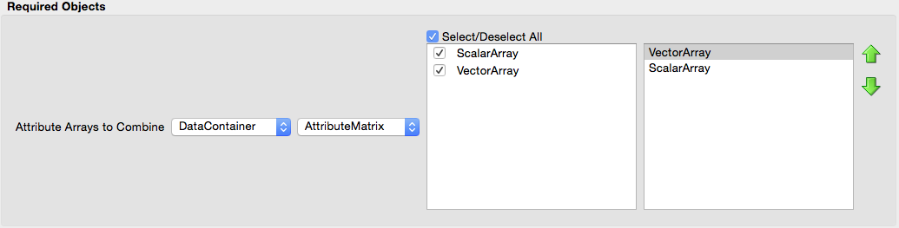

========================
Combine Attribute Arrays
========================

Group (Subgroup)
================

Core (Memory/Management)

Description
===========

This **Filter** will “stack” any number of user-chosen **Attribute Arrays** into a single attribute array and allows the
option to remove the original **Attribute Arrays** once this operation is completed. The arrays must all share the same
primitive type and number of tuples, but may have differing component dimensions. The resulting combined array will have
a total number of components equal to the sum of the number of components for each stacked array. The order in which the
components are placed in the combined array is the same as the ordering chosen by the user when selecting the arrays.
For example, consider two arrays, one that is a 3-vector and one that is a scalar. The values in memory appear as
follows:

*Vector*: tuple 1 - { v1 v2 v3 } ; tuple 2 - { v1 v2 v3 } ; tuple 3 - { v1 v2 v3 } …

*Scalar*: tuple 1 - { s1 } ; tuple 2 - { s1 } ; tuple 3 - { s1 } …

To have the components of the combined array contain the scalar values first, use the box and arrows to the right of the
array selection to move the scalar array above the vector array:

--------------

.. figure:: Images/CombineAttributeArraysGUI_1.png
   :alt: Combine Attribute Arrays: Scalar First

   Combine Attribute Arrays: Scalar First

--------------

After executing the **Filter**, the combined array will have component dimensions of 1 x 4, and will have values in
memory as follows:

*Combined (scalar first)*: tuple 1 - { s1 v1 v2 v3 } ; tuple 2 - { s1 v1 v2 v3 } ; tuple 3 - { s1 v1 v2 v3 } …

To have the components of the combined array contain the vector values first, simply move the vector array above the
scalar array:

--------------

   Combine Attribute Arrays: Vector First

--------------

After executing the **Filter**, the combined array will still have component dimensions of 1 x 4, and but now the values
in memory are as follows:

*Combined (vector first)*: tuple 1 - { v1 v2 v3 s1 } ; tuple 2 - { v1 v2 v3 s1 } ; tuple 3 - { v1 v2 v3 s1 } …

The user may also select to normalize the resulting combined array. The normalization procedure will enforce a range of
[0, 1] for all values in the combined array. This may be useful for combining two arrays that have different order of
magnitude data. Note that this option will fundamentally change the underlying data in the combined array from the
original incoming arrays.

Parameters
==========

================ ==== ==============================================================
Name             Type Description
================ ==== ==============================================================
Standardize Data bool Whether to standardize the combine data on the interval [0, 1]
Move Data        bool Whether to remove the original arrays after combining the data
================ ==== ==============================================================

Required Geometry
=================

Not Applicable

Required Objects
================

====================== ============ ==== ========= ==============================
Kind                   Default Name Type Comp Dims Description
====================== ============ ==== ========= ==============================
Any \**Attribute Array None         Any  Any       Attribute Arrays*\* to combine
====================== ============ ==== ========= ==============================

Created Objects
===============

====================== ============ ==== ========= =================================
Kind                   Default Name Type Comp Dims Description
====================== ============ ==== ========= =================================
Any \**Attribute Array CombinedData Any  Any       Combined **Attribute Array** name
====================== ============ ==== ========= =================================

Example Pipelines
=================

License & Copyright
===================

Please see the description file distributed with this **Plugin**

DREAM3DNX Help
==============

Check out our GitHub community page at `DREAM3DNX-Issues <https://github.com/BlueQuartzSoftware/DREAM3DNX-Issues>`__ to
report bugs, ask the community for help, discuss features, or get help from the developers.
