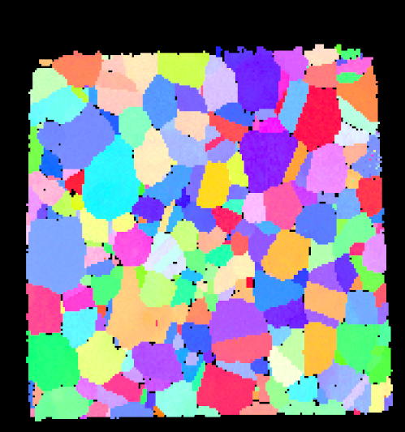
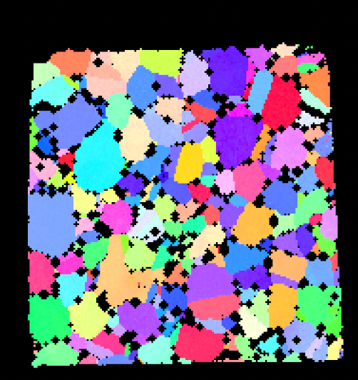
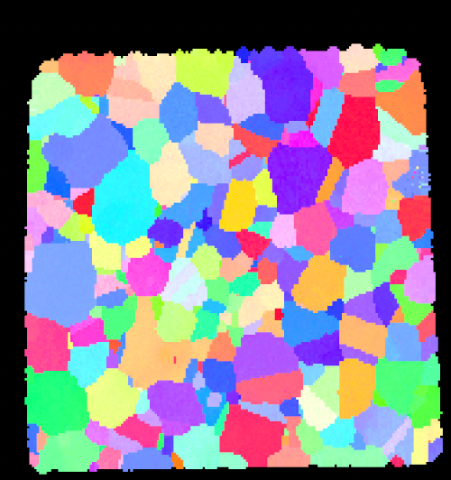

# Erode/Dilate Bad Data

## Group (Subgroup)

Processing (Cleanup)

## Description

Bad data refers to a **Cell** that has a *Feature Id* of *0*, which means the **Cell** has failed some sort of test and
been marked as a *bad* **Cell**.

### Dilation

If the **bad** data is _dilated_, the Filter grows the *bad* data by one **Cell** in
an iterative sequence for a user defined number of iterations. During the *dilate* process the *Feature Id* of any
Cell neighboring a *bad* **Cell** will be changed to *0*.

| Before Dilation                      | After Dilation                       | 
|--------------------------------------|--------------------------------------|
|  |  |

### Erosion

If the *bad* data is _eroded_, the Filter shrinks the
bad data by one **Cell** in an iterative sequence for a user defined number of iterations. During the *erode* process
the *Feature Id* of the *bad* **Cell** is changed from *0* to the *Feature Id* of the majority of its neighbors. If
there is a tie between two _Feature Ids_, then one of the *Feature Ids*, chosen randomly, will be assigned to the *bad*
**Cell**.

| Before Erosion                       | After Erosion                        | 
|--------------------------------------|--------------------------------------|
|  |  |

`

Goals a user might be trying to accomplish with this Filter include:

- Remove small or thin regions of bad data by running a single (or two) iteration *erode* operation.
- Increase the size of a *bad* data region by running an *dilate* operation. This might be useful if the experimental
  technique tends to underestimates the size of certain objects. For example, when running EBSD, the pores (which show
  up as *bad* data) are generally smaller in the scans than in the specimen, because the beam, when it is just inside
  the pore, still can pick up signal from the material just beneath the pore.

Running the _erode-dilate_ operations in pairs can often change the size of some objects without affecting others. For
example, if there were a number of big pores and a number of single *bad* **Cells**, running a single *erode* operation
would remove the single **Cells** and reduce the pores by one **Cell**. If this is followed immediately by a _dilate_
operation, then the pores would grow by one **Cell** and return to near their original size, while the single **Cells**
would remain removed and not "grow back".

## Parameters

| Name                 | Type        | Description                                          |
|-------------|-------------|------------------------------------------------------|
| Operation            | Enumeration | Whether to erode (0) or dilate (1)                   |
| Number of Iterations | int32_t     | The number of iterations to use for erosion/dilation |
| X Direction          | bool        | Whether to erode/dilate in the X direction           |
| Y Direction          | bool        | Whether to erode/dilate in the Y direction           |
| Z Direction          | bool        | Whether to erode/dilate in the Z direction           |

## Required Geometry

Image

## Required Objects

| Kind                     | Default Name   | Type     | Comp Dims | Description                                                      |
|--------------------------|----------------|----------|-------------|------------------------------------------------------------------|
| Image Geometry**       | Image Geometry | DataPath | N/A                  | The path to the Image Geometry where the feature Ids are stored. |
| Cell Attribute Array | FeatureIds     | int32    | (1)                  | Specifies to which **Feature** each **Cell** belongs             |

## Created Objects

None

## Example Pipelines

+ (08) SmallIN100 Full Reconstruction
+ (07) SmallIN100 Final Processing
+ 04_Steiner Compact

## License & Copyright

Please see the description file distributed with this **Plugin**

## DREAM3DNX Help

Check out our GitHub community page at [DREAM3DNX-Issues](https://github.com/BlueQuartzSoftware/DREAM3DNX-Issues) to report bugs, ask the community for help, discuss features, or get help from the developers.

