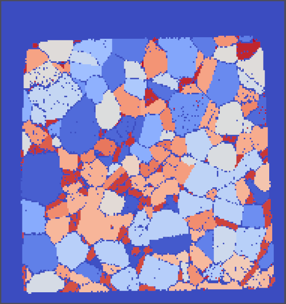

# Smooth Bad Data (Coordination Number)

## Group (Subgroup)

Processing (Cleanup)

## Description

This **Filter** will smooth the interface between *good* and *bad* data. The user can specify a *coordination number*,
which is the number of neighboring **Cells** of opposite type (i.e., *good* or *bad*) compared to a given **Cell** that
is acceptable. For example, a single *bad* **Cell** surrounded by *good* **Cells** would have a *coordination number* of
*6*. The number entered by the user is actually the maximum tolerated *coordination number*. If the user entered a value
of *4*, then all *good* **Cells** with 5 or more *bad* neighbors and *bad* **Cells** with 5 or more *good* neighbors
would be removed. After **Cells** with unacceptable *coordination number* are removed, then the neighboring **Cells**
are *coarsened* to fill the removed **Cells**.

By default, the **Filter** will only perform a single iteration and will not concern itself with the possibility that
after one iteration, **Cells** that were acceptable may become unacceptable by the original *coordination number*
criteria due to the small changes to the structure during the *coarsening*. The user can opt to enable the _Loop Until
Gone_ parameter, which will continue to run until no **Cells** fail the original criteria.

| Before Filter                      | After Filter                       | 
|--------------------------------------|--------------------------------------|
|  |  |

## Parameters

| Name                | Type    | Description                                                                                                                        |
|---------------------|---------|------------------------------------------------------------------------------------------------------------------------------------|
| Coordination Number | int32_t | Number of neighboring **Cells** that can be of opposite classification before a **Cell** will be removed                           |
| Loop Until Gone     | bool    | Whether to run a single iteration or iterate until no *bad* **Cells** have more than the above number of *good* neighbor **Cells** |

## Required Geometry

Image

## Required Objects

| Kind                     | Default Name   | Type     | Component Dimensions | Description                                                      |
|--------------------------|----------------|----------|----------------------|------------------------------------------------------------------|
| **Image Geometry**       | Image Geometry | DataPath | N/A                  | The path to the Image Geometry where the feature Ids are stored. |
| **Cell Attribute Array** | FeatureIds     | int32_t  | (1)                  | Specifies to which **Feature** each **Cell** belongs             |

## Created Objects

None

## Example Pipelines

## License & Copyright

Please see the description file distributed with this **Plugin**

## DREAM3DNX Help

Check out our GitHub community page at [DREAM3DNX-Issues](https://github.com/BlueQuartzSoftware/DREAM3DNX-Issues) to report bugs, ask the community for help, discuss features, or get help from the developers.

