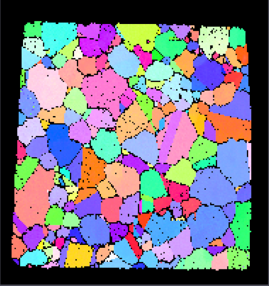
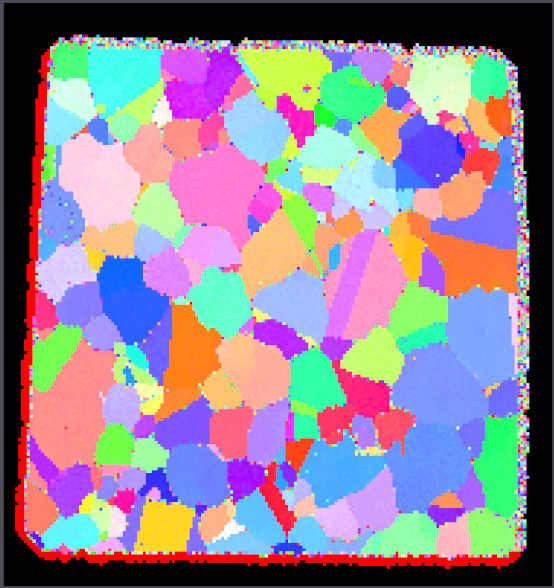
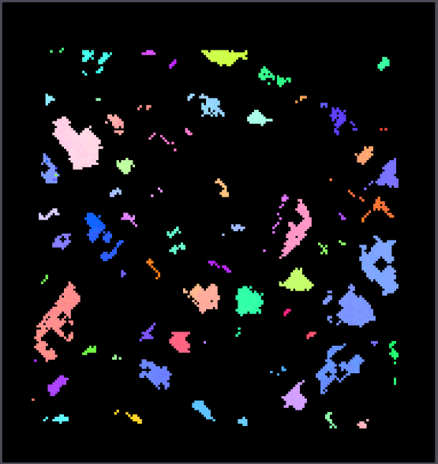

# Erode/Dilate Mask

## Group (Subgroup)

Processing (Cleanup)

## Description

If the mask is _dilated_, the **Filter** grows the *true* regions by one **Cell** in an iterative sequence for a user
defined number of iterations. During the *dilate* process, the classification of any **Cell** neighboring a *false* *
*Cell** will be changed to *true*. If the mask is _eroded_, the **Filter** shrinks the *true* regions by one **Cell** in
an iterative sequence for a user defined number of iterations. During the *erode* process, the classification of the
*false* **Cells** is changed to *true* if one of its neighbors is *true*. The **Filter** also offers the option(s) to
turn on/off the erosion or dilation in specific directions (X, Y or Z).

This filter will ONLY change the _Mask_ data array and not any of the other data arrays in the same attribute matrix.

The example images below were generated **AFTER** the execution of the filter and essentially any black pixel is where the **Mask** was false and any other color is where the **Mask** is true. (The colors are the typical IPF Colors using a <001> reference direction)

| Before Dilatation                      | After Dilation                       | 
|--------------------------------------|--------------------------------------|
|  |  |

| Before Erosion                      | After Erosion                       | 
|--------------------------------------|--------------------------------------|
|  |  |

## Parameters

| Name                 | Type        | Description                                          |
|----------------------|-------------|------------------------------------------------------|
| Operation            | Enumeration | Whether to dilate or erode                           |
| Number of Iterations | int32_t     | The number of iterations to use for erosion/dilation |
| X Direction          | bool        | Whether to erode/dilate in the X direction           |
| Y Direction          | bool        | Whether to erode/dilate in the Y direction           |
| Z Direction          | bool        | Whether to erode/dilate in the Z direction           |

## Required Geometry

Image

## Required Objects

| Kind                     | Default Name | Type | Component Dimensionss | Description                                               |
|--------------------------|--------------|------|-----------------------|-----------------------------------------------------------|
| **Cell Attribute Array** | Mask         | bool | (1)                   | Used to define whether the **Cells** are part of the mask |

## Created Objects

None

## Example Pipelines

## License & Copyright

Please see the description file distributed with this **Plugin**

## DREAM.3D Mailing Lists

If you need more help with a **Filter**, please consider asking your question on
the [DREAM.3D Users Google group!](https://groups.google.com/forum/?hl=en#!forum/dream3d-users)

## Python Filter Arguments

+ module: complex
+ Class Name: ErodeDilateMaskFilter
+ Displayed Name: Erode/Dilate Mask

| argument key | Human Name | Description | Parameter Type |
|--------------|------------|-------------|----------------|
| mask_array_path | Mask Array Path | Boolean array where true voxels are used. False voxels are ignored. | complex.ArraySelectionParameter |
| num_iterations | Number of Iterations | Number of erode/dilate iterations to perform | complex.Int32Parameter |
| operation | Operation | Whether to dilate (0) or erode (1) | complex.ChoicesParameter |
| selected_image_geometry | Selected Image Geometry | The target geometry | complex.GeometrySelectionParameter |
| x_dir_on | X Direction | Whether to erode/dilate in the X direction | complex.BoolParameter |
| y_dir_on | Y Direction | Whether to erode/dilate in the Y direction | complex.BoolParameter |
| z_dir_on | Z Direction | Whether to erode/dilate in the Z direction | complex.BoolParameter |

