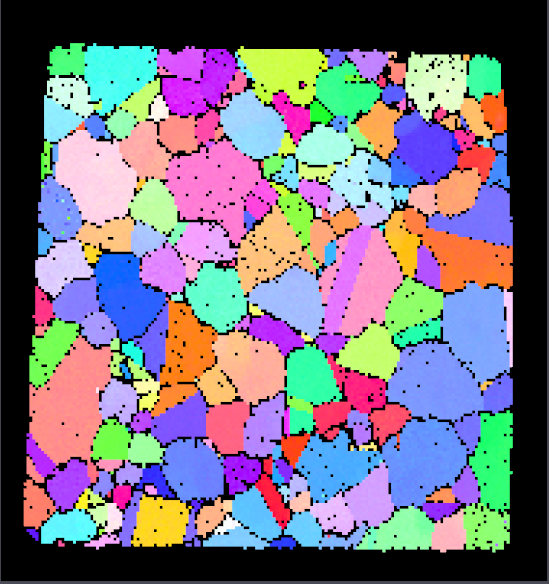

=================
Erode/Dilate Mask
=================

Group (Subgroup)
================

Processing (Cleanup)

Description
===========

If the mask is *dilated*, the **Filter** grows the *true* regions by one **Cell** in an iterative sequence for a user
defined number of iterations. During the *dilate* process, the classification of any **Cell** neighboring a *false*
Cell*\* will be changed to *true*. If the mask is *eroded*, the **Filter** shrinks the *true* regions by one **Cell** in
an iterative sequence for a user defined number of iterations. During the *erode* process, the classification of the
*false* **Cells** is changed to *true* if one of its neighbors is *true*. The **Filter** also offers the option(s) to
turn on/off the erosion or dilation in specific directions (X, Y or Z).

This filter will ONLY change the *Mask* data array and not any of the other data arrays in the same attribute matrix.

The example images below were generated **AFTER** the execution of the filter and essentially any black pixel is where
the **Mask** was false and any other color is where the **Mask** is true. (The colors are the typical IPF Colors using a
<001> reference direction)

================= ==============
Before Dilatation After Dilation
================= ==============
|image1|          |image2|
================= ==============

============== =============
Before Erosion After Erosion
============== =============
|image3|       |image4|
============== =============

Parameters
==========

==================== =========== ====================================================
Name                 Type        Description
==================== =========== ====================================================
Operation            Enumeration Whether to dilate or erode
Number of Iterations int32_t     The number of iterations to use for erosion/dilation
X Direction          bool        Whether to erode/dilate in the X direction
Y Direction          bool        Whether to erode/dilate in the Y direction
Z Direction          bool        Whether to erode/dilate in the Z direction
==================== =========== ====================================================

Required Geometry
=================

Image

Required Objects
================

+-----------------------+------------+----+--------------------+------------------------------------------------------+
| Kind                  | Default    | Ty | Component          | Description                                          |
|                       | Name       | pe | Dimensionss        |                                                      |
+=======================+============+====+====================+======================================================+
| Cell Attribute Array  | Mask       | bo | (1)                | Used to define whether the **Cells** are part of the |
|                       |            | ol |                    | mask                                                 |
+-----------------------+------------+----+--------------------+------------------------------------------------------+

Created Objects
===============

None

Example Pipelines
=================

License & Copyright
===================

Please see the description file distributed with this **Plugin**

DREAM3DNX Help
==============

Check out our GitHub community page at `DREAM3DNX-Issues <https://github.com/BlueQuartzSoftware/DREAM3DNX-Issues>`__ to
report bugs, ask the community for help, discuss features, or get help from the developers.

.. |image2| image:: Images/ErodeDilateMask_Dilate.png

.. |image4| image:: Images/ErodeDilateMask_Erode.png
