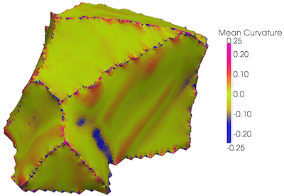

# Find Feature Face Curvature

## Group (Subgroup)

Surface Meshing (Curvature)

## Description

This **Filter** calculates *principal direction vectors* and the *principal curvatures*, and optionally the *mean* and *Gaussian* curvature, for each **Triangle** in a **Triangle Geometry** using the technique in [1]. The groups of **Triangles** over which to compute the curvatures is determines by the **Features** they are associated, denoted by their **Face Labels**. The curvature information will be stored in a **Face Attribute Matrix**.

Principal Curvatures 1 and 2 are the &kappa; 1  and &kappa; 2  from [1] and are the eigenvalues from the Wiengarten matrix. The Principal Directions 1 and 2 are the eigenvectors from the solution to the least squares fit algorithm. The Mean Curvature is (&kappa; 1  + &kappa; 2  ) / 2, while the Gaussian curvature is (&kappa; 1  *
&kappa; 2 ).

*Note*: Computing the Weingarten matrix values is an experimental feature, and there is no guarantee at this time that the values are correct.

@image latex FeatureFaceCurvatureFilter.png "Curvature Coloring of a Feature" width = 6in

## Parameters

| Name | Type | Description |
| ------ | ------ | ---------- - |
| Neighborhood Ring Count | int32_t | The size of the neighborhood to use to calculate the curvature values |
| Compute Principal Direction Vectors | bool | Whether to compute the principal direction vectors |
| Compute Gaussian Curvature | bool | Whether to compute the Gaussian curvature values |
| Compute Mean Curvature | bool | Whether to compute the mean curvature values |
| Compute Weingarten Matrix | bool | Whether to compute the weingarten matrix values |
| Use Face Normals for Curve Fitting | bool | Whether to use the **Face** normals to improve the least squares fit |

## Required Geometry

Triangle

## Required Objects

| Kind | Default Name | Type | Comp Dims | Description |
| ------ | -------------- | ------------ - | -------- - | ---- - |
|**Attribute Matrix**| FaceData | Face | N / A | Specifies which **Attribute Matrix** to store the results |
|**Face Attribute Array**| FaceLabels | int32_t | (2) | Specifies which **Features** are on either side of each Face |
|**Face Attribute Array**| FeatureFaceIds | int32_t | (1) | Specifies to which **Feature** boundary each **Face** belongs |
|**Face Attribute Array**| FaceNormals | double | (3) | Specifies the normal of each Face |
|**Face Attribute Array**| FaceCentroids | double | (3) | Specifies the centroid of each Face |

## Created Objects

| Kind | Default Name | Type | Comp Dims | Description |
| ------ | -------------- | ------------ - | -------- - | ---- - |
|**Face Attribute Array**| PrincipalCurvature1 | double | (1) | First set eigenvalues of the Wiengarten matrix (&kappa;1). Only created if *Compute Principal Direction Vectors*is checked |
|**Face Attribute Array**| PrincipalCurvature2 | double | (1) | Second set eigenvalues of the Wiengarten matrix (&kappa;2). Only created if *Compute Principal Direction Vectors*is checked |
|**Face Attribute Array**| PrincipalDirection1 | double | (3) | First set of eigenvectors. Only created if *Compute Principal Direction Vectors*is checked |
|**Face Attribute Array**| PrincipalDirection2 | double | (3) | Second set of eigenvectors. Only created if *Compute Principal Direction Vectors*is checked |
|**Face Attribute Array**| MeanCurvatures      | double | (1) | Mean curvature values. Only created if *Compute Mean Curvature*is checked |
|**Face Attribute Array**| GaussianCurvatures  | double | (1) | Gaussian curvature values. Only created if *Compute Gaussian Curvature*is checked |
|**Face Attribute Array**| WeingartenMatrix  | double | (4) | Weingarten matrix values. Only created if *Compute Weingarten Matrix*is checked |

## References

[1] J. Goldfeather, V. Interrante, "A Novel Cubic-Order Algorithm for Approximating Principal Direction Vectors", ACM Transactions on Graphics 2004, 23(1), pp. 45 - 63.

## Example Pipelines

## License & Copyright

Please see the description file distributed with this**Plugin**

## DREAM.3D Mailing Lists

If you need more help with a**Filter**, please consider asking your question on the [DREAM.3D Users Google group!](https://groups.google.com/forum/?hl=en#!forum/dream3d-users)
