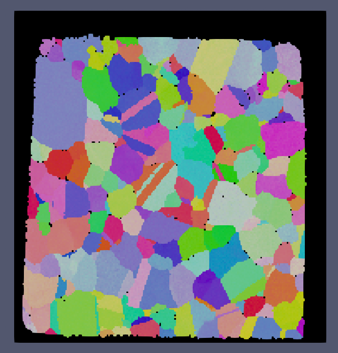
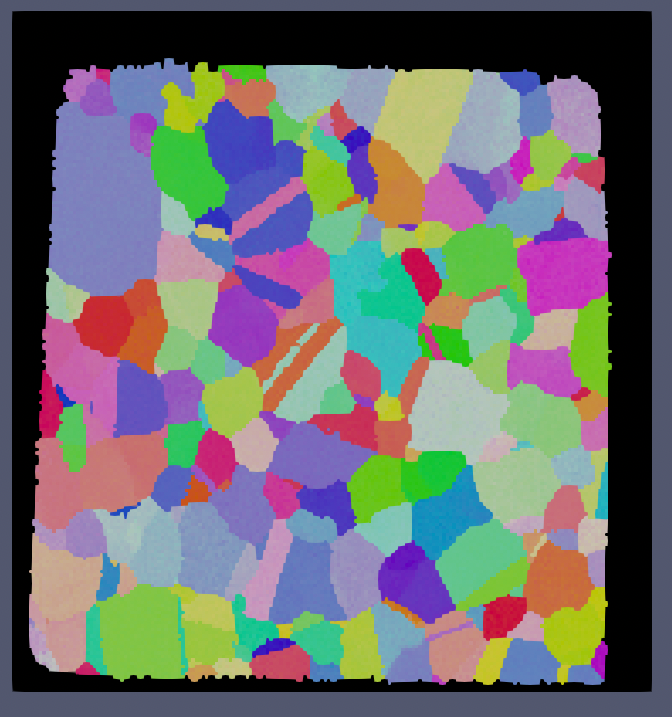

# Fill Bad Data 

## Group (Subgroup)

Processing (Cleanup)

## Description

This **Filter** removes small *noise* in the data, but keeps larger regions that are possibly **Features**, e.g., pores or defects. This **Filter** collects the *bad* **Cells** (*Feature Id = 0*) and *erodes* them until none remain. However, contiguous groups of *bad* **Cells** that have at least as many **Cells** as the minimum allowed defect size entered by the user will not be _eroded_.

| Small IN100 Before | Small IN100 After |
|--|--|
|  |  |

The above images show the before and after results of running this filter with a minimum defect size of 1000 voxels. Note that because the minimum defect size was set to 1000 voxels that the over scan area was not modified (the area in all black around the sample).

## Parameters

| Name | Type | Decision |
|------|------|------|
| Minimum Allowed Defect Size | int32_t | The size at which a group of *bad* **Cells** are left unfilled as a "defect" |
| Replace Bad Data | bool | Whether to replace all data or just *Feature Ids* |
| Store Defects as New Phase | bool | Will update voxels that are part of larger defects to have a new phase value |

## Required Geometry

Image 

## Required Objects

| Kind                      | Default Name | Type     | Comp. Dims | Description                                 |
|---------------------------|--------------|----------|------------|---------------------------------------------|
| Cell Attribute Array | FeatureIds | int32_t | (1) | Specifies to which **Feature** each **Cell** belongs |
| Cell Attribute Array | Phases | int32_t | (1) | Specifies to which **Ensemble** each **Cell** belongs. Only required if *Store Defects as New Phase* is checked |

## Created Objects

None

## Example Pipelines

+ (08) SmallIN100 Full Reconstruction

## License & Copyright

Please see the description file distributed with this **Plugin**

## DREAM3DNX Help

Check out our GitHub community page at [DREAM3DNX-Issues](https://github.com/BlueQuartzSoftware/DREAM3DNX-Issues) to report bugs, ask the community for help, discuss features, or get help from the developers.

