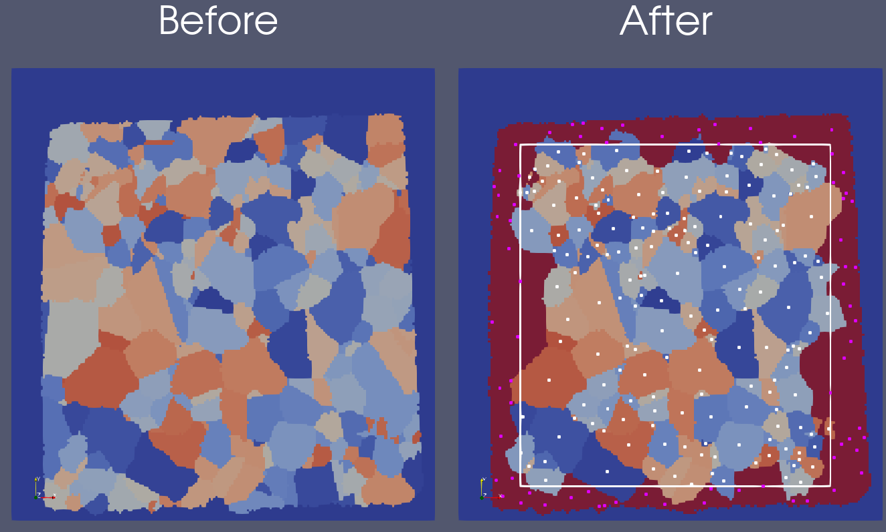

===================================
Find Biased Features (Bounding Box)
===================================

Group (Subgroup)
================

Generic (Spatial)

Description
===========

This **Filter** determines which **Features** are *biased* by the outer surfaces of the sample. Larger **Features** are
more likely to intersect the outer surfaces and thus it is not sufficient to only note which **Features** touch the
outer surfaces of the sample. Denoting which **Features** are biased is important so that they may be excluded from any
statistical analyses. The algorithm for determining whether a **Feature** is *biased* is as follows:

1. The *centroids* of all **Features** are calculated
2. All **Features** are tested to determine if they touch an outer surface of the sample
3. The largest box is found that does not include any of the *centroids* of **Features** that intersect an outer surface
   of the sample
4. Each **Feature**\ ’s *centroid* is checked to see whether it lies within the box.

*If a* **Feature**\ *\ ’s* centroid\* lies within the box, then the **Feature** is said to be *unbiased*, and if it lies
outside the box, then the **Feature** is said to be *biased*.\*

By definition of the box, no **Feature** that intersects an outer surface of the sample can be considered *unbiased*,
but it should be noted that **Features** that do not intersect the outer surfaces may still be considered *biased*. This
algorithm works to determine the biased **Features** because all **Features** have one (and only one) centroid, no
matter their size. Generally, this method will deem more small **Features** biased than the set of **Features** that
just intersect the outer surfaces - and this corrects for the increased likelihood that larger **Features** will touch
an outer surface.

*Note:* This **Filter** is a modification of an algorithm from Dave Rowenhorst (Naval Research Laboratory).

The images below show the feature ids before and after running this filter. The image on the right shows the biased
features colored in red, the unbiased features colored by their feature id, the bounding box (described in step 3 of the
algorithm above), and the feature centroids (white for unbiased and purple for biased). |2D Before and After Biased
Features|

Parameters
==========

==================== ==== ==================================================================
Name                 Type Description
==================== ==== ==================================================================
Apply Phase by Phase bool Whether to apply the biased **Features** algorithm per \**Ensemble
==================== ==== ==================================================================

Required Geometry
=================

Image

Required Objects
================

+-----------------------------+--------------+----------+------------+-------------------------------------------------+
| Kind                        | Default Name | Type     | Comp. Dims | Description                                     |
+=============================+==============+==========+============+=================================================+
| Feature Attribute Array     | Centroids    | float    | (3)        | X, Y, Z coordinates of **Feature** center of    |
|                             |              |          |            | mass                                            |
+-----------------------------+--------------+----------+------------+-------------------------------------------------+
| Feature Attribute Array     | Sur          | bool     | (1)        | Flag of 1 if **Feature** touches an outer       |
|                             | faceFeatures |          |            | surface or of 0 if it does not                  |
+-----------------------------+--------------+----------+------------+-------------------------------------------------+
| Feature Attribute Array     | Phases       | int32_t  | (1)        | Specifies to which **Ensemble** each            |
|                             |              |          |            | **Feature** belongs. Only required if *Apply    |
|                             |              |          |            | Phase by Phase* is checked                      |
+-----------------------------+--------------+----------+------------+-------------------------------------------------+

Created Objects
===============

======================= ============== ==== ========== =======================================================
Kind                    Default Name   Type Comp. Dims Description
======================= ============== ==== ========== =======================================================
Feature Attribute Array BiasedFeatures bool (1)        Flag of 1 if **Feature** is biased or of 0 if it is not
======================= ============== ==== ========== =======================================================

Example Pipelines
=================

-  FindBiasedFeatures.d3dpipeline

License & Copyright
===================

Please see the description file distributed with this **Plugin**

DREAM3DNX Help
==============

Check out our GitHub community page at `DREAM3DNX-Issues <https://github.com/BlueQuartzSoftware/DREAM3DNX-Issues>`__ to
report bugs, ask the community for help, discuss features, or get help from the developers.

