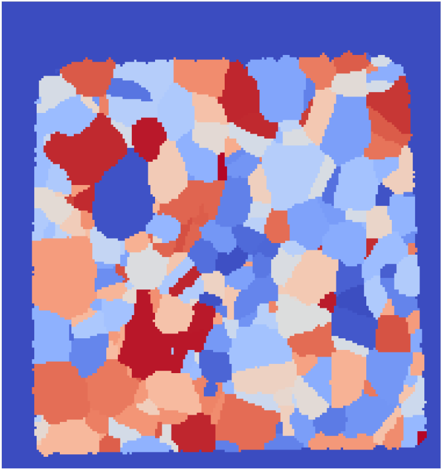
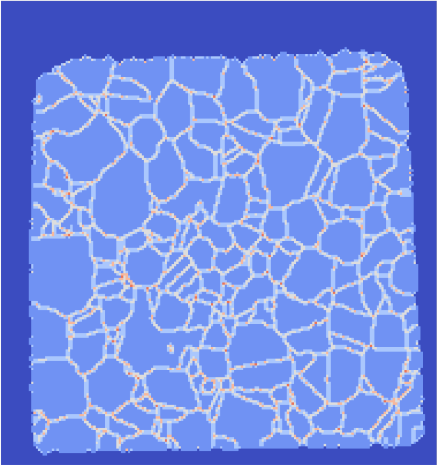

# Find Boundary Cells (Image)

## Group (Subgroup)

Generic (Spatial)

## Description

This **Filter** determines, for each **Cell**, the number of neighboring **Cells** that are owned by a different **Feature**.  The algorithm for determining this is as follows: 

1. Identify the **Feature** to which a **Cell** belongs
2. Identify the **Features** to which each of the current **Cell**'s six (6) face-face neighboring **Cells** (front, back, left, right, up, down) belong
3. Determine the number of those neighboring **Cells** belonging to a different **Feature** than the current **Cell**. 
4. Repeat 1-3 for all **Cells**

| Small IN100 Feature Ids Input | Small IN100 Boundary Cells Output |
|--|--|
|  |  |

## Parameters

| Name             | Type | Description |
|------------------|------|-------------|
| Ignore Feature 0 | bool | Do not use feature 0 |
| Include Volume Boundary | bool | Include the Cell boundaries |

## Required Geometry

Image 

## Required Objects

| Kind | Default Name | Type | Component Dimensions | Description |
|------|--------------|------|----------------------|-------------|
| **Cell Attribute Array** | FeatureIds | int32_t | (1) | Specifies to which **Feature** each **Cell** belongs. |

## Created Objects

| Kind | Default Name | Type | Component Dimensions | Description |
|------|--------------|------|----------------------|-------------|
| **Cell Attribute Array** | BoundaryCells | int8_t | (1) | The number of neighboring **Cells** of a given **Cell** that belong to a different **Feature** than itself. Values will range from *0* to *6* |

## Example Pipelines 

+ FindBoundaryCells.d3dpipeline

## License & Copyright

Please see the description file distributed with this **Plugin**

## DREAM3DNX Help

Check out our GitHub community page at [DREAM3DNX-Issues](https://github.com/BlueQuartzSoftware/DREAM3DNX-Issues) to report bugs, ask the community for help, discuss features, or get help from the developers.

