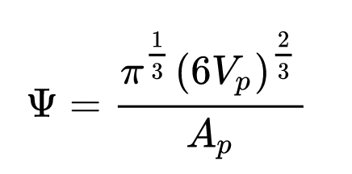

# Find Surface Area to Volume

## Group (Subgroup)

Statistics (Morphological)

## Description

This **Filter** calculates the ratio of surface area to volume for each **Feature** in an **Image Geometry**. First, all the boundary **Cells** are found for each **Feature**. Next, the surface area for each face that is in contact with a different **Feature** is totalled. This number is divided by the volume of each **Feature**, calculated by taking the number of **Cells** of each **Feature** and multiplying by the volume of a **Cell**.

*Note:* The surface area will be the surface area of the **Cells** in contact with the neighboring **Feature** and will be influenced by the aliasing of the structure.  As a result, the surface area to volume will likely be over-estimated with respect to the *real* **Feature**.

This filter also optionally calculate the [Sphericity](https://en.wikipedia.org/wiki/Sphericity) of each feature.

## Parameters

| Name | Type |
|------|------|
| Calculate Sphericity | Boolean |

## Required Geometry

Image

## Required Objects

| Kind                      | Default Name | Type     | Comp Dims | Description                                 |
|---------------------------|--------------|----------|--------|---------------------------------------------|
| Cell Attribute Array | FeatureIds | int32_t | (1) | Specifies to which **Feature** each **Cell** belongs |
| Feature Attribute Array | NumCells |  int32_t | (1) | Number of **Cells** that are owned by the **Feature**. This value does not place any distinction between **Cells** that may be of a different size |

## Created Objects

| Kind                      | Default Name | Type     | Comp Dims | Description                                 |
|---------------------------|--------------|----------|--------|---------------------------------------------|
| Feature Attribute Array | SurfaceAreaVolumeRatio | float | (1) | Ratio of surface area to volume for each **Feature**. The units are inverse length |
| Feature Attribute Array | Sphericity | float | (1) | The sphericity of each feature |

## Example Pipelines

+ (01) SmallIN100 Morphological Statistics

## License & Copyright

Please see the description file distributed with this **Plugin**

## DREAM3DNX Help

Check out our GitHub community page at [DREAM3DNX-Issues](https://github.com/BlueQuartzSoftware/DREAM3DNX-Issues) to report bugs, ask the community for help, discuss features, or get help from the developers.
