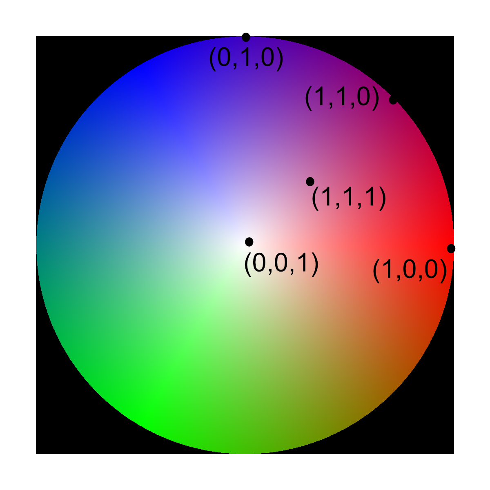

# Generate Vector Colors #

## Group (Subgroup) ##

Generic (Coloring)

## Description ##

This **Filter** generates a color for each **Element** based on the vector assigned to that **Element** in the input vector data.  The color scheme assigns a unique color to all points on the unit hemisphere using a HSV-like scheme. The color space is approximately represented by the following legend.

## Parameters ##

| Name             | Type | Description |
|------------------|------|-------------|
| Apply to Good Voxels Only (Bad Voxels Will Be Black) | bool | Whether or not to assign colors to *bad* voxels or leave them black |

## Required Geometry ##

Not Applicable

## Required Objects ##

| Kind | Default Name | Type | Component Dimensions | Description |
|------|--------------|------|----------------------|-------------|
| **Element Attribute Array** | VectorData | float32 | (3) | Vectors the colors will represent |
| **Element Attribute Array** | Mask | bool | (1) | Used to define **Elements** as *good* or *bad*  |

## Created Objects ##

| Kind | Default Name | Type | Component Dimensions | Description |
|------|--------------|------|----------------------|-------------|
| **Element Attribute Array** | Colors | uint8 | (3) | RGB colors |

## Example Pipelines ##

## License & Copyright ##

Please see the description file distributed with this **Plugin**

## DREAM3DNX Help

Check out our GitHub community page at [DREAM3DNX-Issues](https://github.com/BlueQuartzSoftware/DREAM3DNX-Issues) to report bugs, ask the community for help, discuss features, or get help from the developers.

## Python Filter Arguments

+ module: complex
+ Class Name: GenerateVectorColorsFilter
+ Displayed Name: Generate Vector Colors

| argument key | Human Name | Description | Parameter Type |
|--------------|------------|-------------|----------------|
| cell_vector_colors_array_name | Vector Colors | RGB colors | complex.DataObjectNameParameter |
| good_voxels_array_path | Mask | Used to define Elements as good or bad  | complex.ArraySelectionParameter |
| use_good_voxels | Apply to Good Voxels Only (Bad Voxels Will Be Black) | Whether or not to assign colors to bad voxels or leave them black | complex.BoolParameter |
| vectors_array_path | Vector Attribute Array | Vectors the colors will represent | complex.ArraySelectionParameter |

