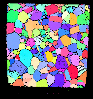

# Isolate Largest Feature (Identify Sample)

## Group (Subgroup)

Processing (Cleanup)

## Description

Often when performing a serial sectioning experiment (especially in the FIB-SEM), the sample is *overscanned* resulting in a border of *bad* data around the sample.  This **Filter** attempts to *identify* the sample within the overscanned volume.  The **Filter** makes the assumption that there is only one contiguous set of **Cells** that belong to the sample. The **Filter** requires that the user has already *thresheld* the data to determine which **Cells** are *good* and which are *bad*.  The algorithm for the identification of the sample is then as follows:

1. Search for the largest contiguous set of *good* **Cells**. (This is assumed to be the sample)
2. Change all other *good* **Cells**  to be *bad* **Cells**.  (This removes the "speckling" of what was *thresheld* as *good* data in the outer border region)

If *Fill Holes* is set to *true*:
3. Search for the largest contiguous set of *bad* **Cells**. (This is assumed to be the outer border region)
4. Change all other *bad* **Cells**  to be *good* **Cells**.  (This removes the "speckling" of what was *thresheld* as *bad* data inside of the sample).

*Note:* if there are in fact "holes" in the sample, then this **Filter** will "close" them (if *Fill Holes* is set to true) by calling all the **Cells** "inside" the sample *good*.  If the user wants to reidentify those holes, then reuse the threshold **Filter** with the criteria of *GoodVoxels = 1* and whatever original criteria identified the "holes", as this will limit applying those original criteria to within the sample and not the outer border region.

| Name | Description |
|------|-------------|
| | Good dataset to use this filter |
| | NOT** a good data set to use because there is **no** overscan of the sample. |

% Auto generated parameter table will be inserted here

## Example Pipelines

+ (10) SmallIN100 Full Reconstruction
+ INL Export
+ (03) SmallIN100 Alignment

## License & Copyright

Please see the description file distributed with this **Plugin**

## DREAM3D-NX Help

If you need help, need to file a bug report or want to request a new feature, please head over to the [DREAM3DNX-Issues](https://github.com/BlueQuartzSoftware/DREAM3DNX-Issues) GItHub site where the community of DREAM3D-NX users can help answer your questions.
