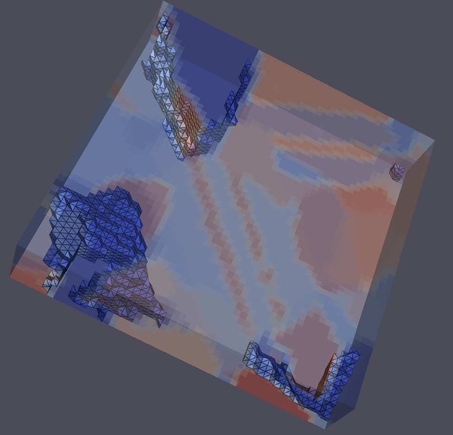

# Contour (Image Contouring)

## Group (Subgroup)

Visual Analysis

## Description

This filter will draw a 3 dimensional contouring line through an Image Geometry based on an input value.

Here's what the results look like:

## Parameters

| Name | Type | Description |
|------|------| ----------- |
| Contour value | float64 | This is the thresholding value that will be used to create the *Contouring Geometry* |

## Required Geometry

Image

## Required Objects

| Kind                      | Default Name | Type     | Comp. Dims | Description                                 |
|---------------------------|--------------|----------|------------|---------------------------------------------|
| Data Array | Data Array to Contour | Any | (1) | This is the array that will be parsed in order to create the contouring geometry, this is what the *Contour Value* will be compared against |

## Created Objects

| Kind         | Default Name | Type | Description                                    |
|--------------|---------------|------|-----------------------------------------------|
| Geometry | Contouring Geometry | TriangleGeom | This stores the 3D contouring line and the normals for the vertices |

## License & Copyright

Please see the description file distributed with this **Plugin**

## DREAM.3D Interaction

If you need more help with a **Filter**, please consider asking your question on the [DREAM.3D Help Forum!](https://github.com/BlueQuartzSoftware/DREAM3DNX-Issues)

