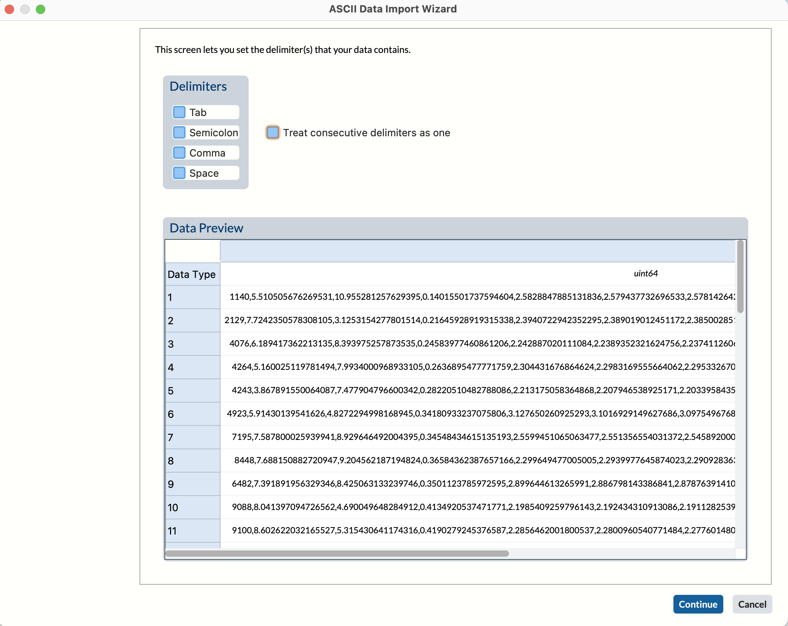
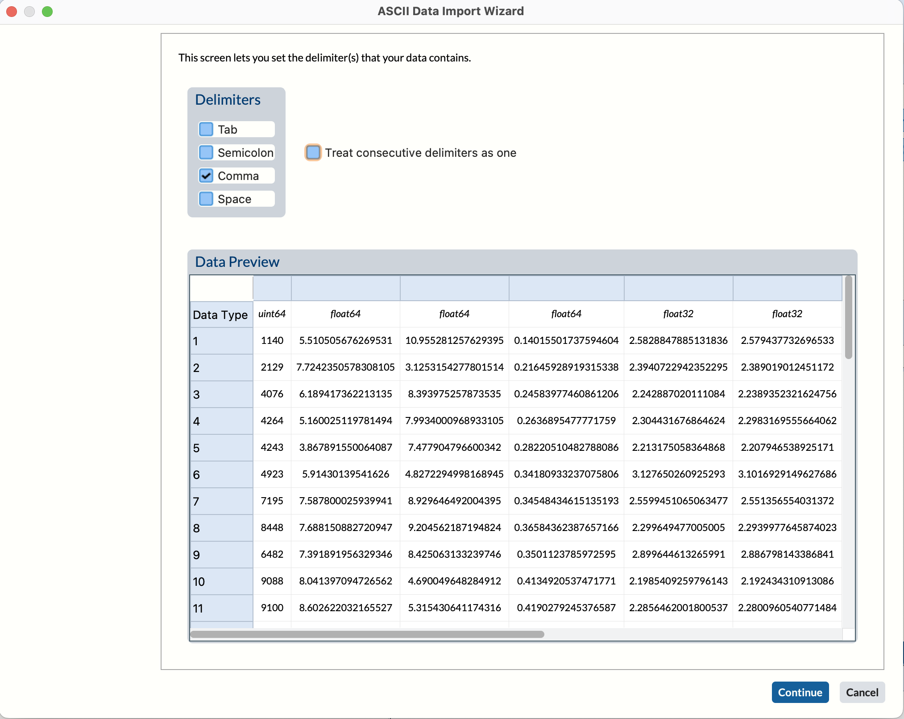
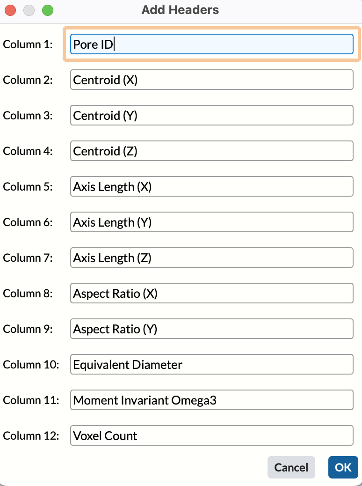

# Import CSV Data 

## Group (Subgroup) ##

IO (Input)

## Description ##

This **Filter** reads CSV data from any text-based file and imports the data into DREAM3D-NX-style arrays.  The user uses the **Filter's** wizard to specify which file to import, how the data is formatted, what to call each array, and what type each array should be.

*Note:* This **Filter** is intended to read data that is column-oriented, such that each created DREAM3D-NX array corresponds to a column of data in the CSV file. Therefore, this **Filter** will only import scalar arrays. If multiple columns are in fact different components of the same array, then the columns may be imported as separate arrays and then combined in the correct order using the Combine Attribute Arrays **Filter**.

### Separating the Data ###

After clicking the **Import Data...** button and selecting a file, a wizard appears. The user can choose how the data is delimited: comma (,), tab, semicolon (;) or space ( ). The user may also elect to treat consecutive delimiters as one delimiter.

### Selecting the Delimiter ###

### Selecting Import Rows, Data Representation and Column Headers ###

On the last page, the user can set the following information:

+ Header names, either from a line number in the file or manually through a dialog box or select the generated header values
+ Row index to start the import
+ Column data format (choosing the data type or deciding to skip the column)

If the data does not have any headers, the user can set a string value for each column. These values will be used as the name of the **Data Array** in DREAM3D-NX.

## Parameters ##

| Name | Type | Description |
|------|------|-------------|
| Wizard Data Object | CSVWizardData | The object that holds all relevant data collected from the wizard |
| Tuple Dimensions | DynamicTableData | The tuple dimensions for the arrays being imported from the file |
| Use Existing Group | bool | Determines whether or not to store the imported data arrays in an existing group |
| Existing Data Group (Use Existing Group - ON) | DataPath | The data path to the existing group where the imported arrays will be stored |
| New Data Group (Use Existing Group - OFF) | DataPath | The data path to the newly created group where the imported arrays will be stored |

## Required Geometry ##

Not Applicable

## Required Objects ##

| Kind | Default Name | Description |
|------|--------------|------|----------------------|-------------|
| **Data Group** | None | The existing data group to store the imported data arrays (only if Existing Data Group is turned ON) |

## Created Objects ##

| Kind | Default Name | Type | Component Dimensions | Description |
|------|--------------|------|----------------------|-------------|
| One or more **Element/Feature/Ensemble/etc. Data Arrays** | None | Any | 1 | One or more arrays that are created due to importing CSV data via the wizard |

## Example Pipelines ##

## License & Copyright ##

Please see the description file distributed with this plugin.

## DREAM3DNX Help

Check out our GitHub community page at [DREAM3DNX-Issues](https://github.com/BlueQuartzSoftware/DREAM3DNX-Issues) to report bugs, ask the community for help, discuss features, or get help from the developers.

