# Partition Geometry

## Group (Subgroup) ##

Reconstruction (Reconstruction)

## Description ##

This **Filter** generates a partition grid and assigns partition IDs for every voxel/node of a given geometry.

If the **Filter** determines that any voxel/node of the original geometry is out-of-bounds compared to the generated partition grid, the **Out-Of-Bounds Cell ID** will be used as the partition ID in the output partition IDs array.

## Partitioning Modes ##
There are four available partitioning modes to choose from: **1. Basic**, **2. Advanced**, **3. Bounding Box**, and **4. Existing Partition Grid**

### Basic ###

This partitioning mode is commonly used to create a partition grid that is exactly the same size as the input geometry and divided up into a specific number of cells in the X, Y, & Z dimensions.  This mode requires the **Starting Feature ID**, **Number of Cells Per Axis**, and (optionally) the **Use Vertex Mask** input parameters.

| Figure 1: 5x5x5 Partition Grid |
|:---:|
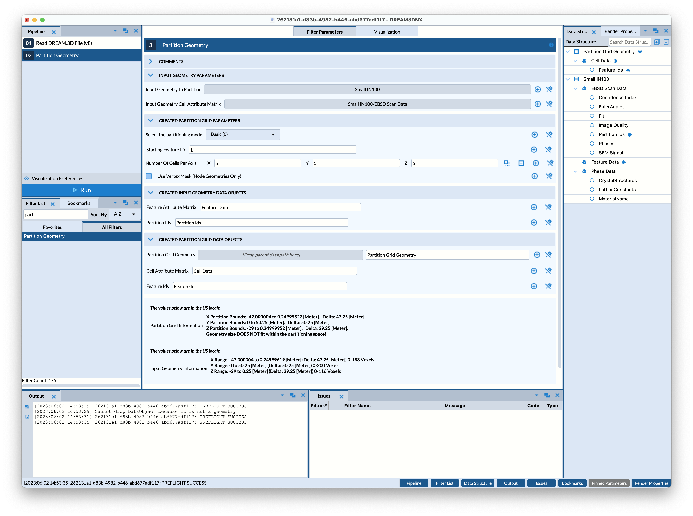

In **Figure 1** above, the PartitionGeometry filter is using the SmallIN100 image geometry as an input geometry to generate a 5x5x5 partition grid with 125 features and the following outputs:

1. An image geometry called **Partition Grid Geometry** with a data array containing all the partition grid ids called **Feature Ids**.
2. An attribute matrix called **Cell Data** that contains all the cell data arrays for the newly created partition grid.
3. A cell data array called **Feature Ids** that contains the newly created partition grid's ids.
4. An attribute matrix called **Feature Data**, used to store any future feature data for the given SmallIN100 input geometry.
5. A cell data array called **Partition Ids** that contains the assigned partition ids for all voxels in the SmallIN100 input geometry.

| Figure 1A: Partition Grid Feature Id 111 | Figure 1B: SmallIN100 Partition Id 111 |
|:---:|:---:|
| 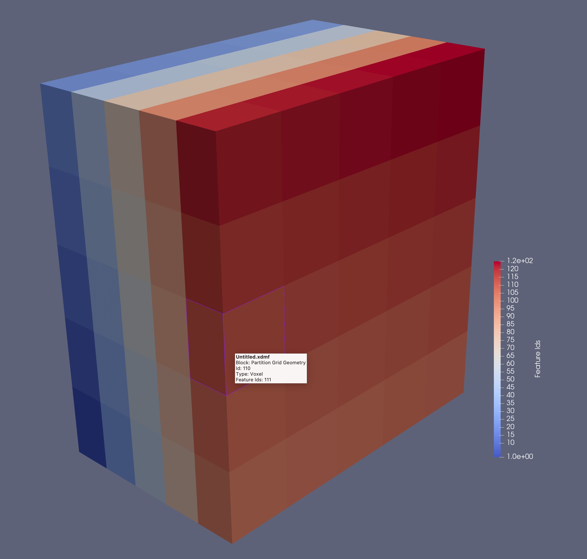 | 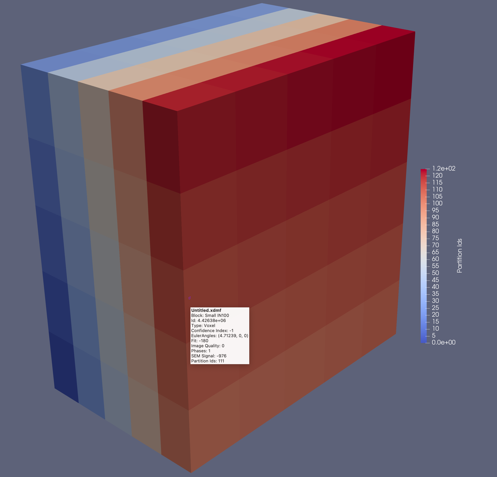 |

In **Figure 1A** above, feature ID 111 is shown highlighted in the newly created partition grid.  In **Figure 1B** above, the same 111 feature ID is shown as the assigned partition ID for the currently highlighted voxel.

### **Advanced** ###

This partitioning mode is commonly used to create a custom sized partition grid that the input geometry may or may not fit within.  This mode requires the **Starting Feature ID**, **Out-of-Bounds Feature ID**, **Number of Cells Per Axis**, **Partition Grid Origin**, **Cell Length**, and (optionally) the **Use Vertex Mask** input parameters.

_Note_: If the given input geometry does not fit within the partition grid, any out of bounds voxels/nodes will be assigned the **Out-of-Bounds Feature ID** as their **Partition ID**.

| Figure 2: 12x4x6 Partition Grid, Partition Grid Origin = (-50, -15, -40), Cell Lengths = 5x19x7 |
|:---:|
| 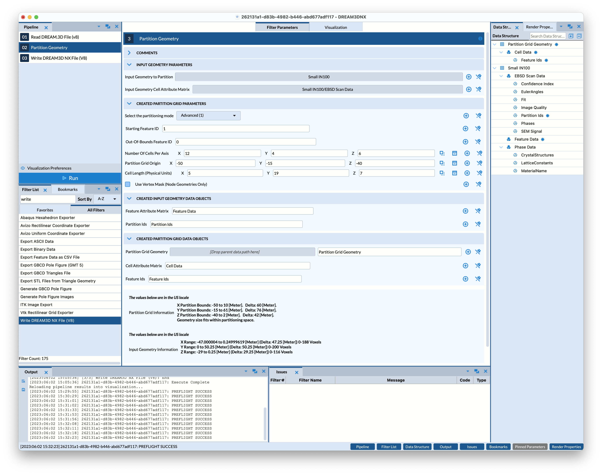 |

In **Figure 2** above, the PartitionGeometry filter is using the SmallIN100 image geometry as an input geometry to generate a 12x4x6 partition grid with 288 features, cell length 5x19x7, and the following outputs:

1. An image geometry called **Partition Grid Geometry** with a data array containing all the partition grid ids called **Feature Ids**.
2. An attribute matrix called **Cell Data** that contains all the cell data arrays for the newly created partition grid.
3. A cell data array called **Feature Ids** that contains the newly created partition grid's ids.
4. An attribute matrix called **Feature Data**, used to store any future feature data for the given SmallIN100 input geometry.
5. A cell data array called **Partition Ids** that contains the assigned partition ids for all voxels in the SmallIN100 input geometry.

| Figure 2A: Partition Grid | Figure 2B: Sliced Partition Grid |
|:---:|:---:|
| 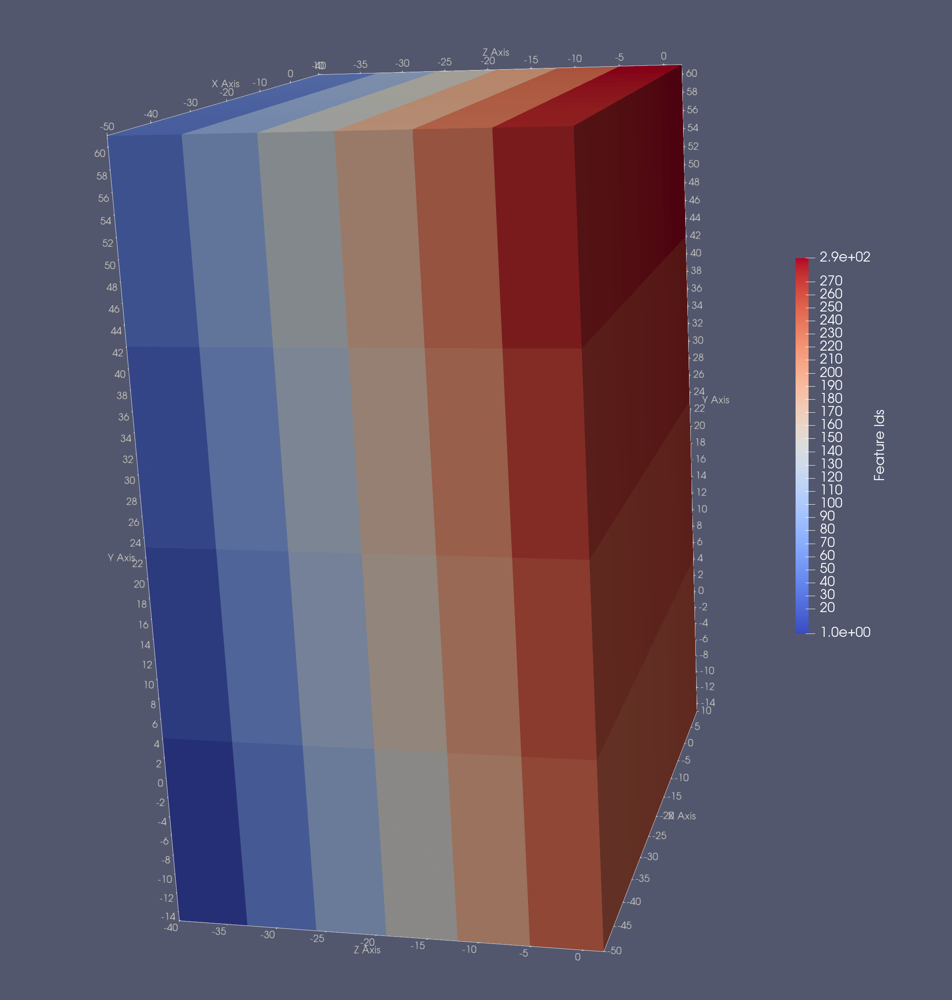 |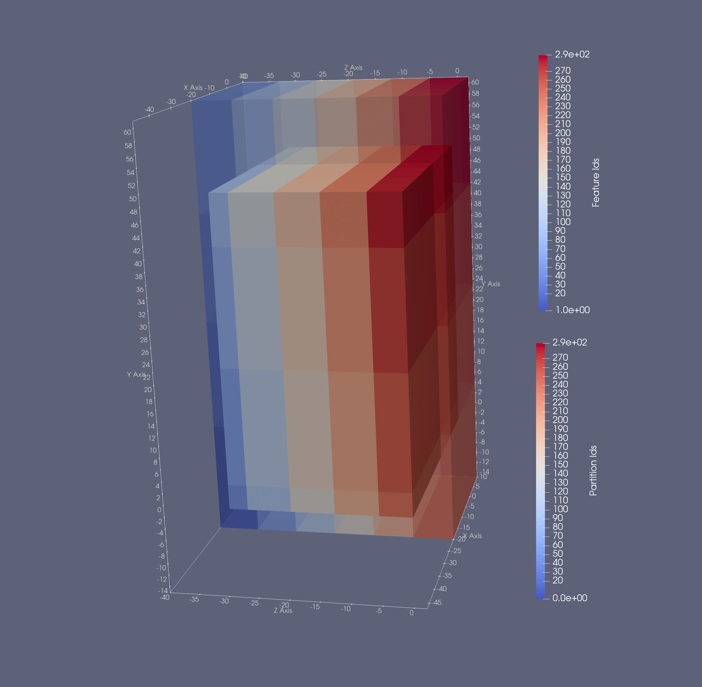|

In **Figure 2A** above, the newly created partition grid is shown.  It is a 12x4x6 grid with an origin of (-50, -15, -40), and cell length 5x19x7.

In **Figure 2B** above, the partition grid is sliced open to show the SmallIN100 dataset that is contained inside of it.  The SmallIN100 dataset has partition IDs that correspond to the feature IDs in the partition grid.

| Figure 3: 5x4x6 Partition Grid, Partition Grid Origin = (-20, -15, -15), Cell Lengths = 4x19x7 |
|:---:|
| 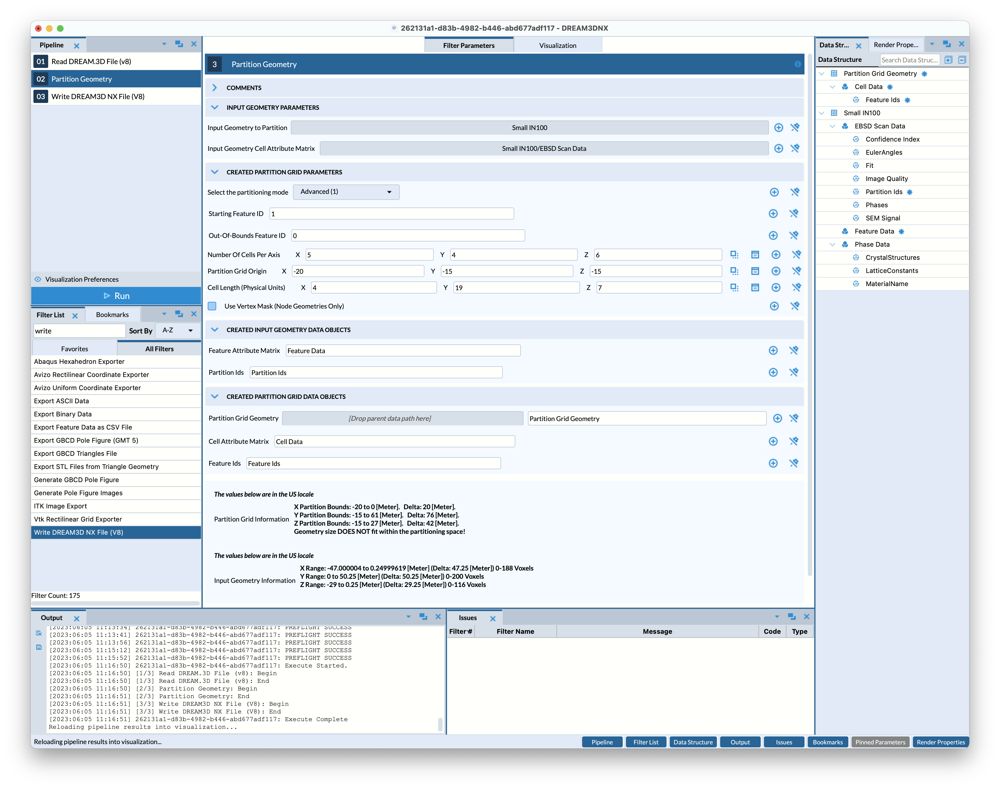 |

In **Figure 3** above, the PartitionGeometry filter is using the SmallIN100 image geometry as an input geometry to generate a 5x4x6 partition grid with 120 features, cell lengths 4x19x7.

| Figure 3A: Dataset Does Not Fit Inside Partition Grid | Figure 3B: Dataset Does Not Fit Inside Partition Grid |
|:---:|:---:|
| 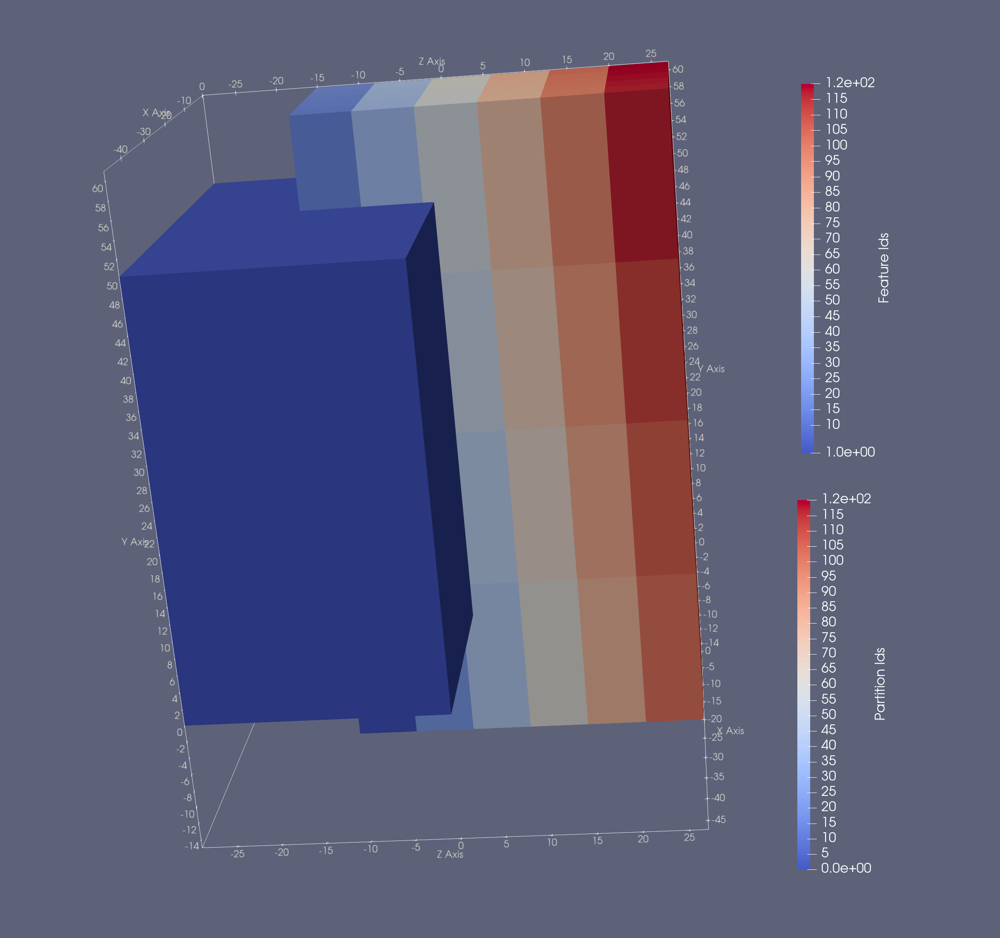 | 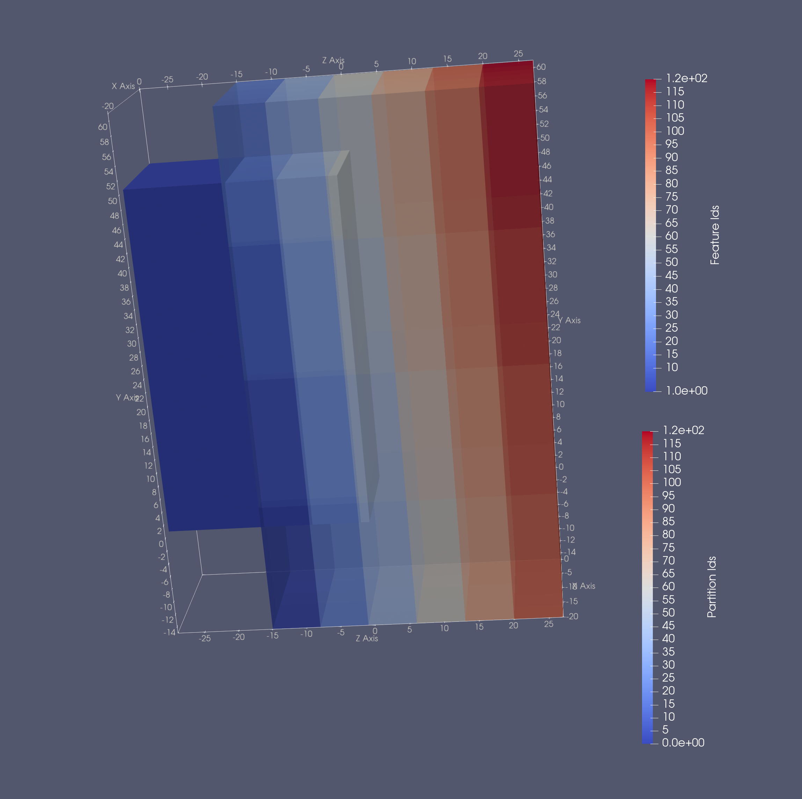 |

In **Figure 3A** above, the newly created partition grid is shown intersecting the SmallIN100 dataset.  Any part of the SmallIN100 dataset that is outside the partition grid is marked with the **Out-of-Bounds Feature ID**, which in this case is 0.

In **Figure 3B** above, the SmallIN100 dataset is sliced open to show the partition IDs that have been set with the corresponding feature IDs from the partition grid.

### **Bounding Box** ###

This partitioning mode is commonly used to create a custom sized partition grid using a minimum and maximum grid coordinate.  The input geometry may or may not fit within this partition grid.  This mode is very similar to the **Advanced** partitioning mode; it requires the **Starting Feature ID**, **Out-of-Bounds Feature ID**, **Number of Cells Per Axis**, **Minimum Grid Coordinate**, **Maximum Grid Coordinate**, and (optionally) the **Use Vertex Mask** input parameters.  Basically, instead of specifying a partition grid origin and cell length to determine the location and physical size of the partition grid, the minimum and maximum grid coordinates are used.

| Figure 4: 5x5x5 Partition Grid |
|:---:|
| 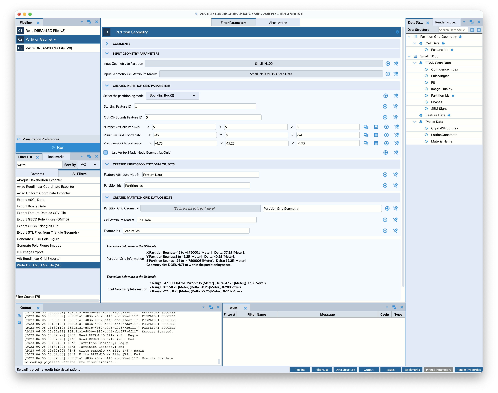 |

In **Figure 4** above, the PartitionGeometry filter is using the SmallIN100 image geometry as an input geometry to generate a 5x5x5 partition grid with 125 features, a minimum coordinate of (-42, 5, -24), and a maximum coordinate of (-4.75, 45.25, -4.75).

| Figure 4A: Partition Grid Inside Dataset | Figure 4B: Partition Grid Inside Dataset - Sliced |
|:---:|:---:|
| 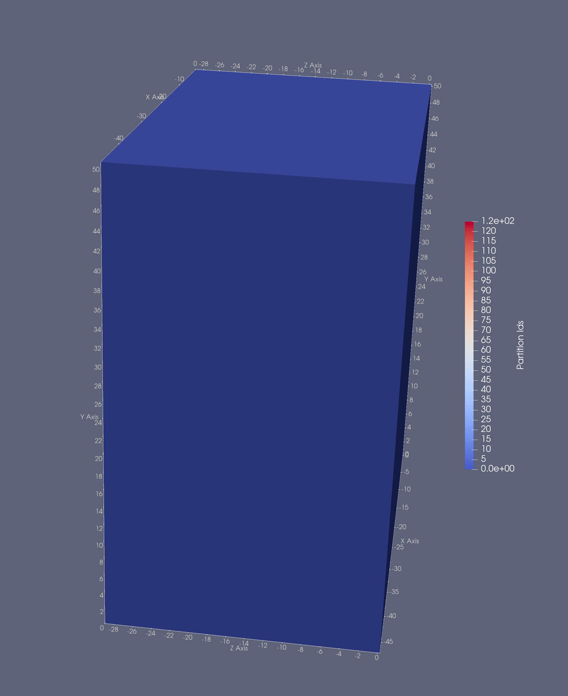 | 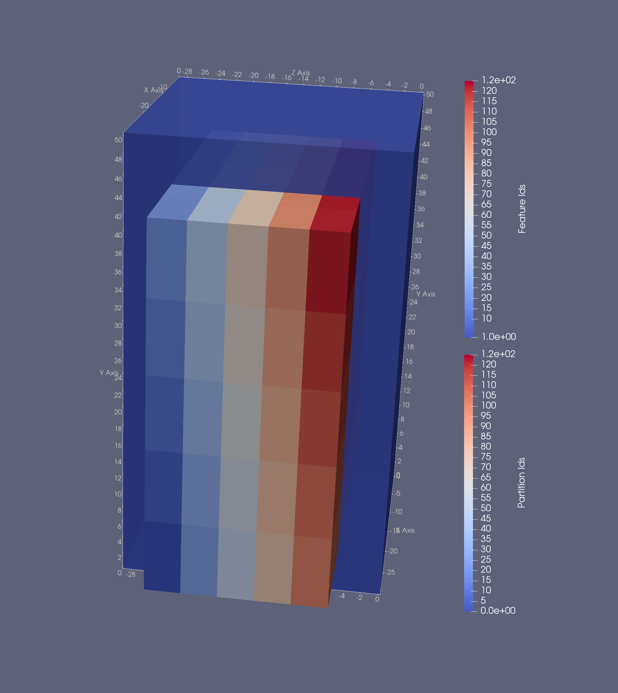 |

In **Figure 4A** above, the SmallIN100 dataset is shown.  In **Figure 4B** above, the dataset is sliced to show the newly created partition grid contained within.  The partition grid is about 5 units smaller on all sides compared to the SmallIN100 input geometry.

### **Existing Partition Grid** ###

This partitioning mode is chosen when the user already has a partition grid from a previous run of the Partition Geometry filter.  Just select an existing **Partition Grid Geometry** and pick the **Out-of-Bounds Feature ID**, and then partition IDs will be assigned to the input dataset when the filter is executed.

## Using A Vertex Mask ##

On all partitioning modes, a vertex mask can be used with a vertex-based input geometry to determine which vertices should be assigned a valid partition ID.  Any vertices with a mask value of 0 or False will have its Partition ID set to the Out-of-Bounds Feature ID.

| Figure 5A: Vertex With Mask Value = True | Figure 5B: Vertex With Mask Value = False |
|:---:|:---:|
| 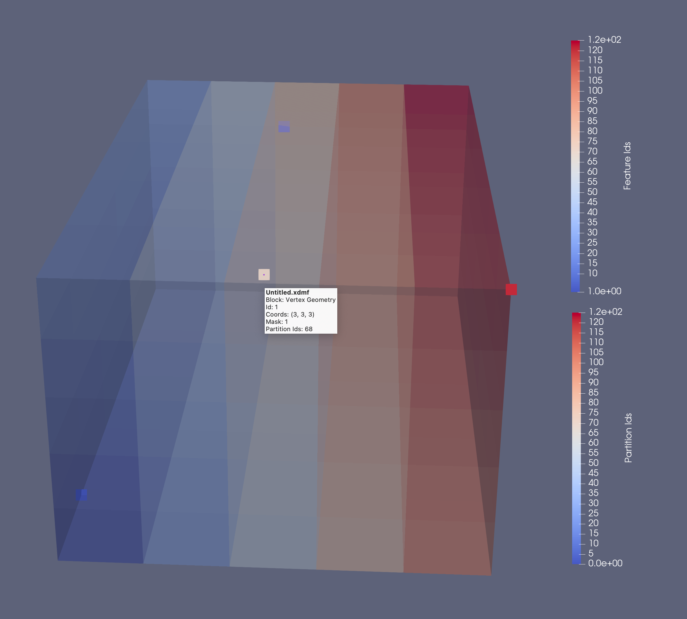 | 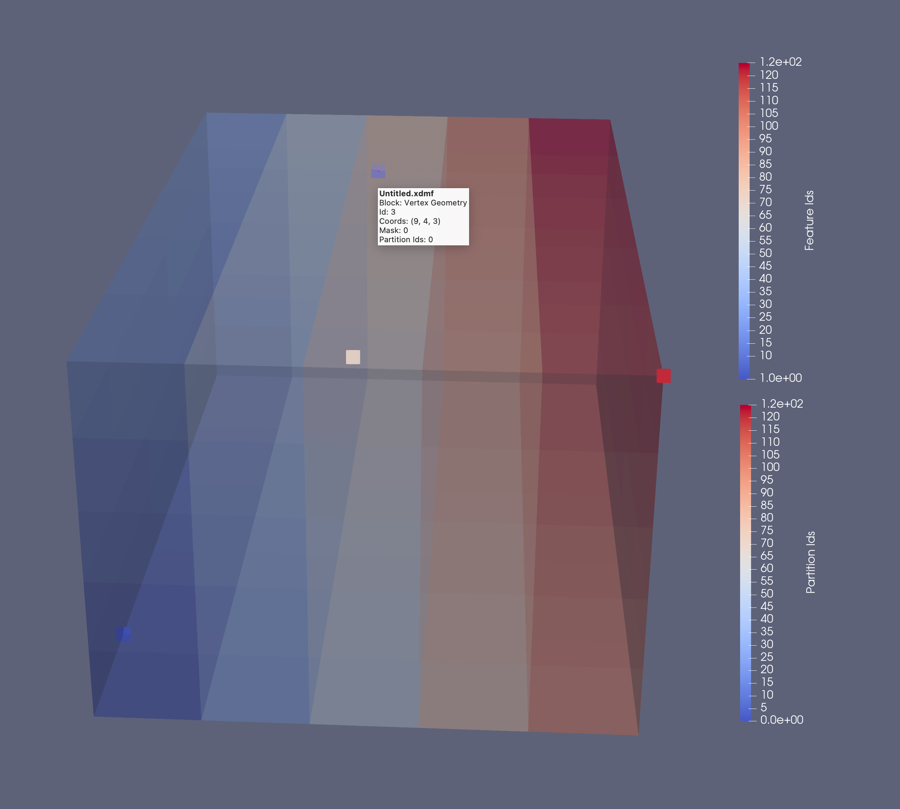 |

## Parameters ##

| Name | Type | Description |
|------|------|------|
| Input Geometry to Partition | DataPath | The path to the geometry object that the filter will partition. |
| Input Geometry Cell Attribute Matrix | DataPath | The path to the attribute matrix where the partition ids array will be stored. |
| Partitioning Mode | int | The mode used to partition the geometry.  The choices are Basic, Advanced, Bounding Box, and Existing Partition Grid. |
| Starting Feature ID | int | The starting ID to use when creating the partition grid. |
| Out-Of-Bounds Feature ID | int | The default ID used when the voxel or node in the input geometry is out-of-bounds compared to the partition grid. Available in all modes except for Basic mode (not needed since all voxels are in-bounds). |
| Number of Cells Per Axis (X,Y,Z) | IntVec3 | The number of cells that will be created in each partition grid axis. |
| Partition Grid Origin (X,Y,Z) | FloatVec3 | The origin of the partition grid. Only available in Advanced mode. |
| Cell Length (X,Y,Z) | FloatVec3 | The length of each cell in each partition grid axis. Only available in Advanced mode. |
| Minimum Grid Coordinate (X,Y,Z) | FloatVec3 | The minimum coordinate for the bounding box of the partition grid. Only available in Bounding Box mode. |
| Maximum Grid Coordinate (X,Y,Z) | FloatVec3 | The maximum coordinate for the bounding box of the partition grid. Only available in Bounding Box mode. |
| Existing Partition Grid | DataPath | The path to an image geometry that contains an existing partition grid. Only available in Existing Partition Grid mode. |
| Use Vertex Mask | bool | Determines whether or not to use a vertex mask when partitioning the input geometry. |
| Vertex Mask | DataPath | The path to the vertex mask array. |
| Feature Attribute Matrix | string | The name of the feature attribute matrix that will be created. |
| Partition Ids | string | The name of the partition ids array that will be created. |
| Partition Grid Geometry | DataPath | The path to the partition grid geometry that will be created. |
| Cell Attribute Matrix | string | The name of the attribute matrix that will be created as a child of the partition grid geometry. |
| Feature Ids | string | The name of the feature ids array that will be created as a child of Cell Attribute Matrix. |

## Example Pipelines ##

None

## License & Copyright ##

Please see the description file distributed with this plugin.

## DREAM3DNX Help

Check out our GitHub community page at [DREAM3DNX-Issues](https://github.com/BlueQuartzSoftware/DREAM3DNX-Issues) to report bugs, ask the community for help, discuss features, or get help from the developers.

