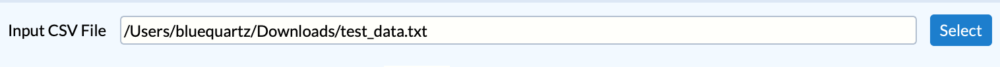
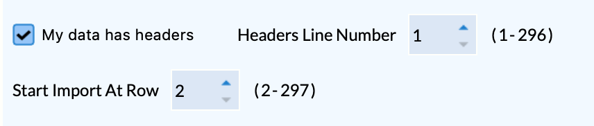
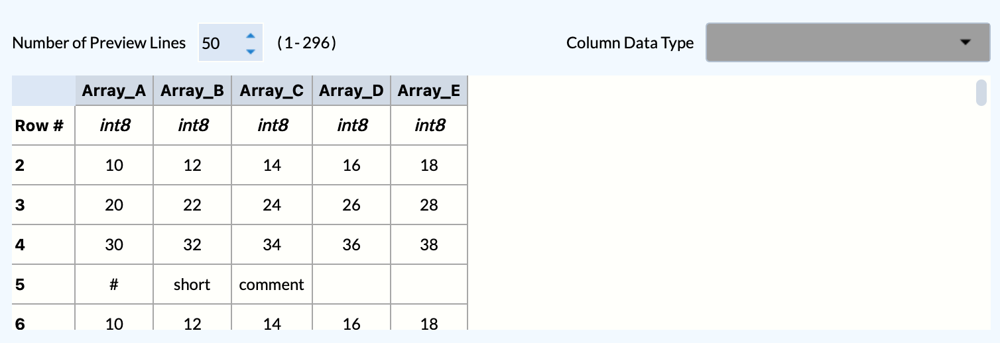
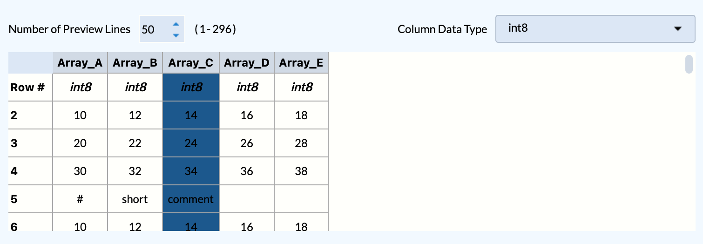
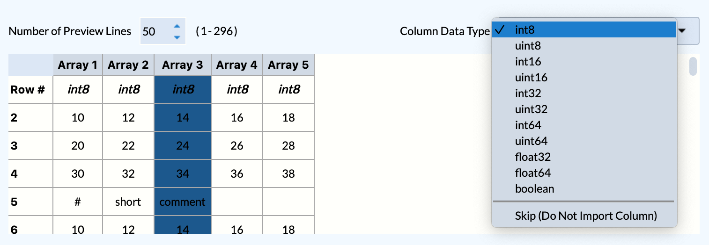
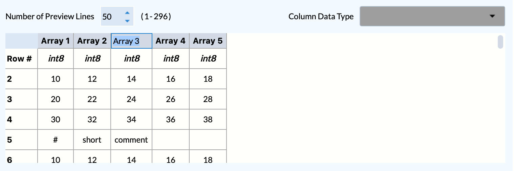
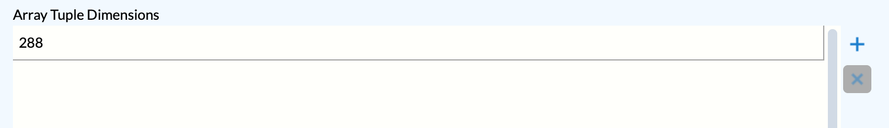
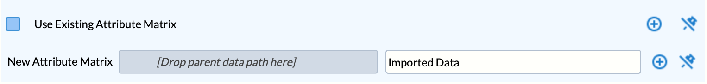
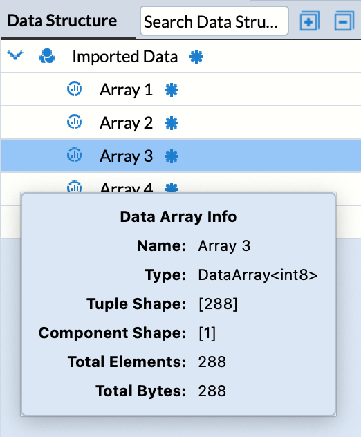

# Read CSV File

## Group (Subgroup)

IO (Input)

## Description

This **Filter** reads text data from any text-based file and imports the data into DREAM3D-NX-style arrays.  The user specifies which file to import, how the data is formatted, what to call each array, and what type each array should be.

*Note:* This **Filter** is intended to read data that is column-oriented, such that each created DREAM3D-NX array corresponds to a column of data in the text file. Therefore, this **Filter** will only import scalar arrays. If multiple columns are in fact different components of the same array, then the columns may be imported as separate arrays and then combined in the correct order using the Combine Attribute Arrays **Filter**.

### Filling Out The Inputs

The user first selects the **Input Text File** path, which then enables the rest of the interface.

If the chosen **Input Text File** already has headers inside the file, the user can select the **Input File Has Headers** checkbox.  This
enables the **Headers Line Number** spin box where the user can select which line of the file contains the headers.

*NOTE*: The interface only allows importing data starting at the line after the chosen **Headers Line Number**.  So, in the example below, the **Headers Line Number** is set to 1, so **Start Import Line Number** defaults to 2 and has a range of 2-297 (this particular input file has 297 total lines).  The max range of **Headers Line Number** is, of course, set to 296 so that at least 1 line can be imported.

The user can choose how the data is delimited: comma (,), tab, semicolon (;) or space ( ). The user may also elect to ignore consecutive delimiters, which treats consecutive delimiters as one delimiter.

The user can select the number of preview lines available by changing the **Number of Preview Lines** spin box.  The range in the example is set to 1-296 because the import is currently starting at row 2 (from **Start Import Line Number** spin box).

The user can then set the data format for each column.  Selecting one or more columns will enable the **Column Data Type** combo box, where you can choose a data type or decide to skip importing specific columns as well.

If the **Input File Has Headers** checkbox is OFF, then it is also possible to double-click the headers in the Preview Table to edit them.  These values will be used as the name of the **Data Array** in DREAM3D-NX.

*NOTE:* Editing table headers is only available when the **Input File Has Headers** checkbox is OFF.  If the **Input File Has Headers** checkbox is ON, then the headers will be read from the **Headers Line Number** in the data file, and the table headers will not be editable.

The user can select the tuple dimensions that will be applied to the imported arrays.

The imported arrays can be stored in either an existing attribute matrix or a new attribute matrix can be created.

Afterwards, you end up with a data structure that looks like this:

% Auto generated parameter table will be inserted here

## License & Copyright

Please see the description file distributed with this plugin.

## DREAM3D-NX Help

If you need help, need to file a bug report or want to request a new feature, please head over to the [DREAM3DNX-Issues](https://github.com/BlueQuartzSoftware/DREAM3DNX-Issues) GItHub site where the community of DREAM3D-NX users can help answer your questions.
