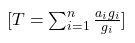

==========================
Robust Automatic Threshold
==========================

.. role:: raw-latex(raw)
   :format: latex
..

Group (Subgroup)
================

DREAM3D Review (Threshold)

Description
===========

This **Filter** automatically computes a threshold value for a scalar **Attribute Array** based on the array’s gradient
magnitude, producing a boolean array that is *false* where the input array is less than the threshold value and *true*
otherwise. The threshold value is computed using the following equation:

   :raw-latex:`\f[` T = :raw-latex:`\sum`\_{i = 1}^{n} :raw-latex:`\frac{a_{i} g_{i}}{g_{i}}` :raw-latex:`\f]`

where :raw-latex:`\f`$ a :raw-latex:`\f`$ is the input array, :raw-latex:`\f`$ g :raw-latex:`\f`$ is the gradient
magnitude array, :raw-latex:`\f`$ n :raw-latex:`\f`$ is the length of the input array, and :raw-latex:`\f`$ T
:raw-latex:`\f`$ is the computed threshold value. Computing a threshold in this manner will generally partition the
input array where its gradient is highest. Gradients may be computed using the Find Derivatives **Filter**. The gradient
magnitude may then be found by computing the 2-norm of the gradient.

Parameters
==========

None

Required Geometry
=================

None

Required Objects
================

====================== ============ =============== ========== ==============================================
Kind                   Default Name Type            Comp. Dims Description
====================== ============ =============== ========== ==============================================
Any \**Attribute Array None         Any except bool (1)        Attribute Array*\* to threshold
Attribute Array        None         float           (1)        Gradient magnitude of input \**Attribute Array
====================== ============ =============== ========== ==============================================

Created Objects
===============

+-----------------------------+--------------+----------+------------+-------------------------------------------------+
| Kind                        | Default Name | Type     | Comp. Dims | Description                                     |
+=============================+==============+==========+============+=================================================+
| Attribute Array             | Mask         | bool     | (1)        | Mask array produced after application of the    |
|                             |              |          |            | computed robust threshold to the input          |
|                             |              |          |            | \**Attribute Array                              |
+-----------------------------+--------------+----------+------------+-------------------------------------------------+

Example Pipelines
=================

License & Copyright
===================

Please see the description file distributed with this plugin.

DREAM3DNX Help
==============

Check out our GitHub community page at `DREAM3DNX-Issues <https://github.com/BlueQuartzSoftware/DREAM3DNX-Issues>`__ to
report bugs, ask the community for help, discuss features, or get help from the developers.
