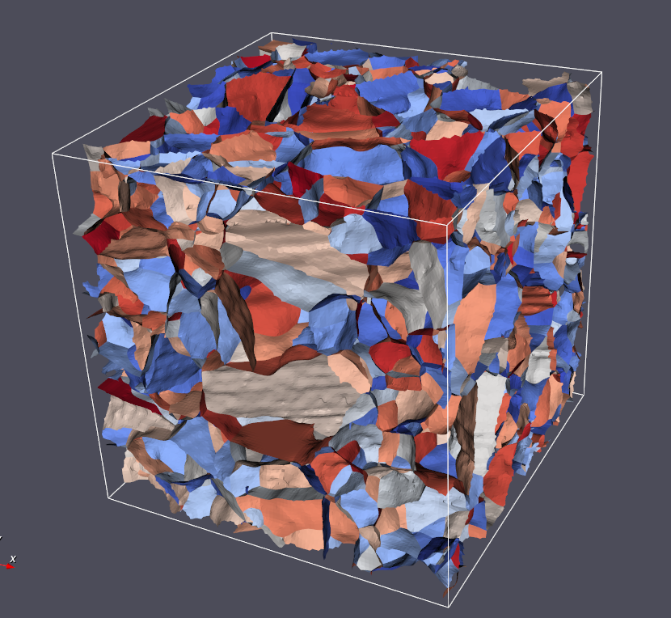
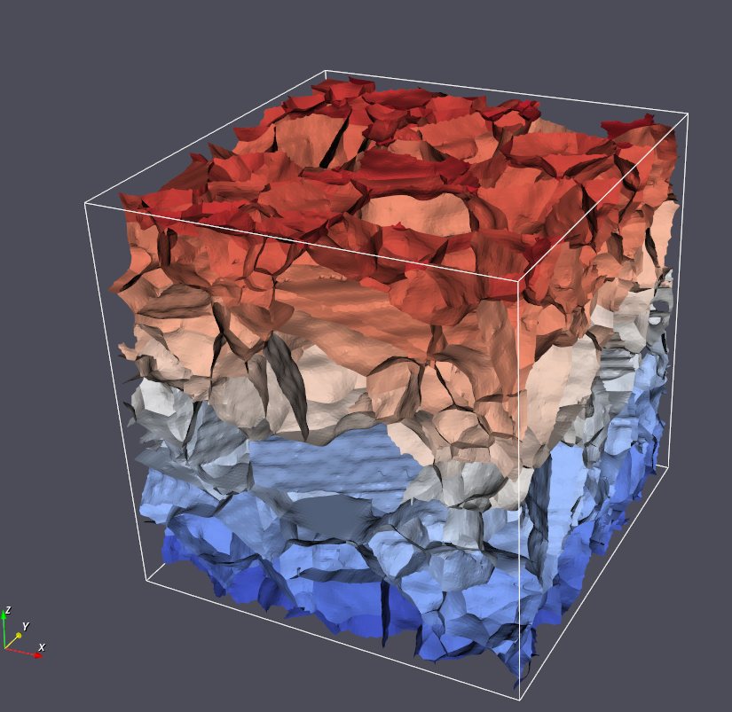

Generate Triangle Face Ids
============

## Group (Subgroup)

Surface Meshing (Connectivity/Arrangement)

## Description

This **Filter** assigns a unique Id to each **Triangle** in a **Triangle Geometry** that represents the _unique
boundary_ on which that **Triangle** resides. For example, if there were only two **Features** that shared one boundary,
then the **Triangles** on that boundary would be labeled with a single unique Id. This procedure creates _unique groups_
of **Triangles**, which themselves are a set of **Features**. Thus, this **Filter** also creates a **Feature Attribute
Matrix** for this new set of **Features**, and creates **Attribute Arrays** for their Ids and number of **Triangles**. This
process can be considered a **segmentation** where each unique id is the shared boundary between two features. 

Because the algorithm is essentially segmenting the triangles based on the unique combination of face labels, the filter will
also generate a Feature level Attribute Matrix and place two additional *DataArrays* into that feature attribute matrix
that store the following information: 
    
1. The number of triangles in each unique boundary
2. The pair of Face Label values that made up the unique boundary.

### Generated Feature Boundaries *with* Randomization

### Generated Feature Boundaries *without* Randomization

---------------

## Parameters ##

| Name                     | Type    | Description                                                                         |
|--------------------------|---------|-------------------------------------------------------------------------------------|
| Randomize Feature Values | boolean | Should the final 'FeatureFaceId' Array be randomized. This can aid in visualization |

## Required Geometry

Triangle

## Required Objects

| Kind                     | Default Name | Type    | Comp Dims | Description                                                      |
|--------------------------|--------------|---------|-------------|------------------------------------------------------------------|
| Face Attribute Array | FaceLabels   | int32_t | (2)                  | Specifies which **Features** are on either side of each **Face |

## Created Objects

| Kind                        | Default Name    | Type         | Comp Dims | Description                                                                          |
|-----------------------------|-----------------|--------------|-------------|--------------------------------------------------------------------------------------|
| Face Attribute Array**    | FeatureFaceId   | int32_t      | (1)                  | Specifies to which **Feature** each **Face** belongs                                 |
| Attribute Matrix**        | FaceFeatureData | Face Feature | N/A                  | Created **Feature Attribute Matrix** name                                            |
| Feature Attribute Array | FaceLabels      | int32_t      | (2)                  | Specifies which *original* **Features** are on either side of each *new* **Feature |
| Feature Attribute Array | NumTriangles    | int32_t      | (1)                  | Number of **Triangles** in each **Feature**                                          |

## Example Pipelines

"(03) Small IN100 Mesh Statistics.d3dpipeline"

## License & Copyright

Please see the description file distributed with this **Plugin**

## DREAM3DNX Help

Check out our GitHub community page at [DREAM3DNX-Issues](https://github.com/BlueQuartzSoftware/DREAM3DNX-Issues) to report bugs, ask the community for help, discuss features, or get help from the developers.

