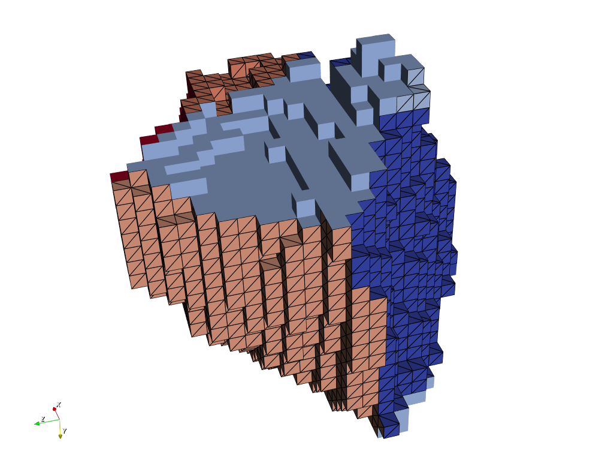
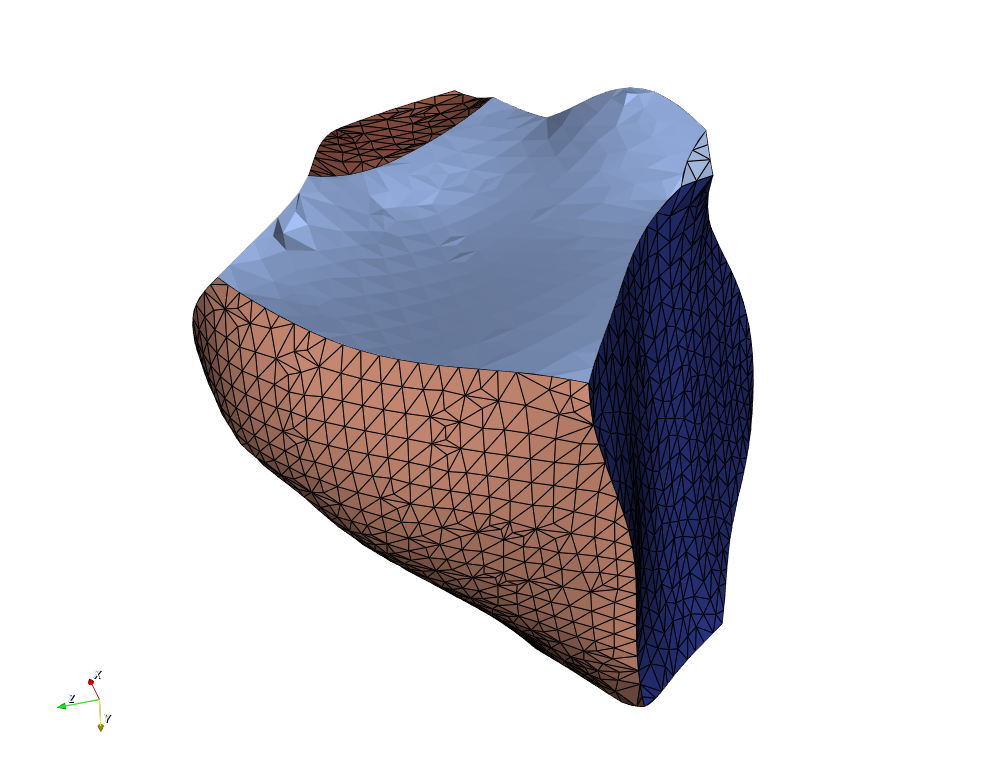

# SurfaceNets Filter #

## Group (Subgroup) ##

Surface Meshing (Generation)

## Description ##

This filter uses the algorithm from {1} to produce a triangle surface mesh. The code is directly based on the sample code from the paper but has been modified to
work with the complex library classes.

This filter will ensure that the smaller of the 2 **FaceLabel** values will always be in the first component (component[0]). This will allow assumptions made in
downstream filters to continue to work correctly.

---------------

SurfaceNets without the built in smoothing applied

---------------

SurfaceNets output **with** the built in smoothing operation applied.

---------------

## Parameters ##

| Human Name | Description | Parameter Type |
|--------------|-------------|----------------|
| Apply Smoothing Operation | This will enable the built-in smoothing from the SurfaceNets algorithm | complex.BoolParameter |
| Relaxation Iterations | The number of smoothing iterations to perform | complex.Int32Parameter |
| Max Distance from Voxel | The maximum allowable distance that a node can move from the voxel center  | complex.Float32Parameter |
| Relaxation Factor | How far a node can move during each smoothing operation | complex.Float32Parameter |

## Required Geometry ##

Image/RectGrid

## Required Objects ##

| Kind                         | Default Name | Type    | Component Dimensions | Description                                                                                |
|------------------------------|--------------|---------|----------------------|--------------------------------------------------------------------------------------------|
| **Cell Attribute Array**     | FeatureIds   | int32_t | (1)                  | Specifies to which **Feature** each **Cell** belongs                                       |
| Any **Cell Attribute Array** | None         | Any     | Any                  | Specifies which **Cell Attribute Arrays** to transfer to the created **Triangle Geometry** |

## Created Objects ##

| Kind                         | Default Name          | Type         | Component Dimensions | Description                                                      |
|------------------------------|-----------------------|--------------|----------------------|------------------------------------------------------------------|
| **Data Container**           | TriangleDataContainer | N/A          | N/A                  | Created **Data Container** name with a **Triangle Geometry**     |
| **Attribute Matrix**         | VertexData            | Vertex       | N/A                  | Created **Vertex Attribute Matrix** name                         |
| **Vertex Attribute Array**   | NodeTypes             | int8_t       | (1)                  | Specifies the type of node in the **Geometry**                   |
| **Attribute Matrix**         | FaceData              | Face         | N/A                  | Created **Face Attribute Matrix** name                           |
| **Face Attribute Array**     | FaceLabels            | int32_t      | (2)                  | Specifies which **Features** are on either side of each **Face** |
| **Attribute Matrix**         | FaceFeatureData       | Face Feature | N/A                  | **Feature Attribute Matrix** of the created _Face Labels_        |
| Any **Face Attribute Array** | None                  | Any          | Any                  | The set of transferred **Cell Attribute Arrays**                 |

## Example Pipelines ##

## Citations ##

{1}[SurfaceNets for Multi-Label Segmentations with Preservation of Sharp Boundaries](https://jcgt.org/published/0011/01/03/paper.pdf)

## License & Copyright ##

`Sarah F. Frisken, SurfaceNets for Multi-Label Segmentations with Preservation of Sharp
Boundaries, Journal of Computer Graphics Techniques (JCGT), vol. 11, no. 1, 34–54, 2022`
[http://jcgt.org/published/0011/01/03](http://jcgt.org/published/0011/01/03)

## DREAM.3D Mailing Lists ##

If you need more help with a **Filter**, please consider asking your question on
the [DREAM.3D Users Google group!](https://groups.google.com/forum/?hl=en#!forum/dream3d-users)

