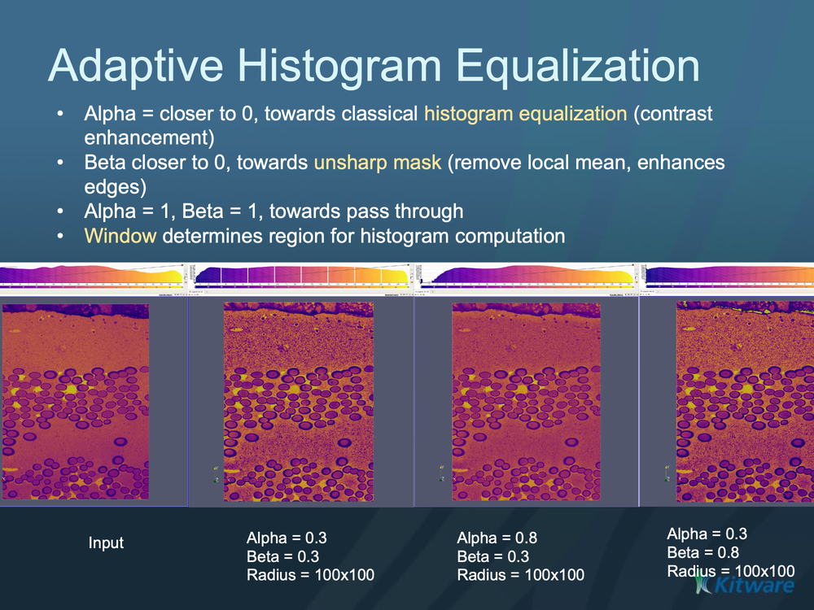

# ITK Adaptive Histogram Equalization Image Filter

Enhances local contrast using a tunable power-law adaptive histogram equalization.

## Group (Subgroup)

ITKImageStatistics (ImageStatistics)

## Description

Histogram equalization redistributes pixel intensities to improve contrast. This filter is *adaptive*: instead of one global remap, it computes statistics in a local window around each pixel and applies a power-law mapping controlled by *alpha*, *beta*, and the window size. By tuning those parameters it can behave like classical histogram equalization, like an unsharp mask (local mean subtraction), or anything in between.

### Parameter Guidance

- **Alpha** — blends between classical histogram equalization (*alpha = 0*) and an unsharp mask (*alpha = 1*). Dimensionless, range 0-1.
- **Beta** — blends between an unsharp mask (*beta = 0*) and pass-through / no change (*beta = 1*, with *alpha = 1*). Dimensionless, range 0-1.
- **Radius** — the half-width of the local window per axis, **in pixels**; the window spans `2 × Radius + 1` pixels along each axis (default radius *5*). Larger windows use broader local statistics.

### Required Input Sources

Operates on any scalar image — typically from [Read Image](../SimplnxCore/ReadImageFilter.md), [Read Images [3D Stack]](../SimplnxCore/ReadImageStackFilter.md), or the output of a prior ITK image filter.

## Reference

J. Alex Stark, "Adaptive Image Contrast Enhancement using Generalizations of Histogram Equalization," *IEEE Transactions on Image Processing*, May 2000.

% Auto generated parameter table will be inserted here

## Example Pipelines

## License & Copyright

Please see the description file distributed with this **Plugin**

## DREAM3D-NX Help

If you need help, need to file a bug report or want to request a new feature, please head over to the [DREAM3DNX-Issues](https://github.com/BlueQuartzSoftware/DREAM3DNX-Issues/discussions) GitHub site where the community of DREAM3D-NX users can help answer your questions.
