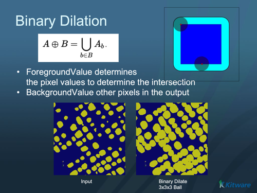

# ITK Binary Dilate Image Filter

Grows (dilates) the foreground objects of a binary or segmented image.

## Group (Subgroup)

ITKBinaryMathematicalMorphology (BinaryMathematicalMorphology)

## Description

**Dilation** is a morphological operation that grows the foreground region of an image: a small probe shape called the **structuring element** is swept over the image, and any background pixel touched by the structuring element when it is centered on a foreground pixel becomes foreground. Dilation fills small gaps, connects nearby objects, and enlarges objects by the radius of the structuring element. (The inverse operation is [ITK Binary Erode Image Filter](ITKBinaryErodeImageFilter.md); combining the two gives [opening](ITKBinaryMorphologicalOpeningImageFilter.md) and [closing](ITKBinaryMorphologicalClosingImageFilter.md).)

The filter treats one chosen value as foreground. This makes it work directly on segmented images: if segment 1 has value 1, segment 2 has value 2, and so on, set *Foreground Value* to the segment number you want to dilate.

### Parameter Guidance

- **Foreground Value** — the pixel value treated as the object/foreground (everything else is background). Default *1*.
- **Background Value** — the value used for background pixels. Default *0*.
- **Boundary To Foreground** — controls whether the region just outside the image border is treated as foreground or background, which affects objects that touch the edge of the volume.
- **Kernel Radius** — the radius of the structuring element, **in pixels** (one value per axis). Objects grow by this amount.

#### Kernel Type

The *Kernel Type* parameter selects the structuring element shape:

- **Annulus [0]**: A ring-shaped structuring element.
- **Ball [1]**: A spherical structuring element (default). Most commonly used for general morphological operations.
- **Box [2]**: A rectangular/cuboid structuring element.
- **Cross [3]**: A cross-shaped structuring element.

### Required Input Sources

Operates on a binary/segmented image — typically the output of a thresholding filter such as [ITK Binary Threshold Image Filter](ITKBinaryThresholdImageFilter.md) or [Multi-Threshold Objects](../SimplnxCore/MultiThresholdObjectsFilter.md).

% Auto generated parameter table will be inserted here

## Example Pipelines

## License & Copyright

Please see the description file distributed with this **Plugin**

## DREAM3D-NX Help

If you need help, need to file a bug report or want to request a new feature, please head over to the [DREAM3DNX-Issues](https://github.com/BlueQuartzSoftware/DREAM3DNX-Issues/discussions) GitHub site where the community of DREAM3D-NX users can help answer your questions.
