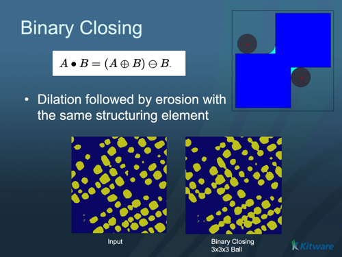

# ITK Binary Morphological Closing Image Filter

Fills small holes and thin gaps in the foreground of a binary image (dilation followed by erosion).

## Group (Subgroup)

ITKBinaryMathematicalMorphology (BinaryMathematicalMorphology)

## Description

**Closing** is a morphological operation that fills small holes and thin gaps inside and along the borders of foreground objects, without much changing their overall size. It is a **dilation followed by an erosion** using the same structuring element: `Closing(f) = Erosion(Dilation(f))`. The dilation fills features smaller than the **structuring element** (the probe shape swept over the image), and the following erosion shrinks the objects back to roughly their original size. Use it to close up pinholes and cracks in segmented regions. The inverse pairing is [ITK Binary Morphological Opening Image Filter](ITKBinaryMorphologicalOpeningImageFilter.md), which removes small specks instead.

### Parameter Guidance

- **Foreground Value** — the pixel value treated as the object/foreground. Default *1*.
- **Kernel Radius** — the radius of the structuring element, **in pixels** (one value per axis). Holes/gaps smaller than this are filled.
- **Safe Border** — when on (default), a temporary border is added around the image during processing to avoid edge artifacts and removed afterward.

#### Kernel Type

The *Kernel Type* parameter selects the structuring element shape:

- **Annulus [0]**: A ring-shaped structuring element.
- **Ball [1]**: A spherical structuring element (default). Most commonly used for general morphological operations.
- **Box [2]**: A rectangular/cuboid structuring element.
- **Cross [3]**: A cross-shaped structuring element.

### Required Input Sources

Operates on a binary/segmented image — typically the output of a thresholding filter such as [ITK Binary Threshold Image Filter](ITKBinaryThresholdImageFilter.md) or [Multi-Threshold Objects](../SimplnxCore/MultiThresholdObjectsFilter.md).

## Reference

G. Lehmann, "Binary morphological closing and opening image filters," Insight Journal, <https://www.insight-journal.org/browse/publication/58>.

% Auto generated parameter table will be inserted here

## Example Pipelines

## License & Copyright

Please see the description file distributed with this **Plugin**

## DREAM3D-NX Help

If you need help, need to file a bug report or want to request a new feature, please head over to the [DREAM3DNX-Issues](https://github.com/BlueQuartzSoftware/DREAM3DNX-Issues/discussions) GitHub site where the community of DREAM3D-NX users can help answer your questions.
