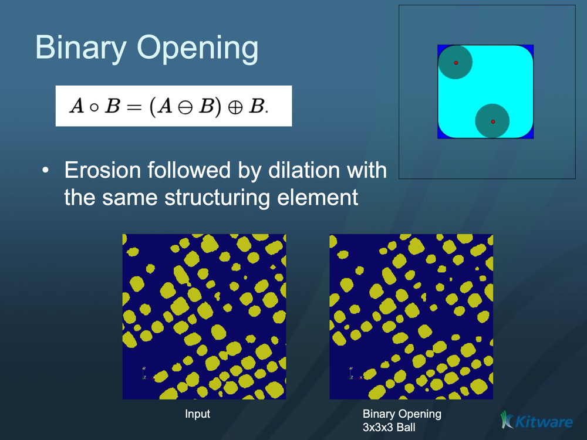

# ITK Binary Morphological Opening Image Filter

Removes small foreground specks and thin protrusions from a binary image (erosion followed by dilation).

## Group (Subgroup)

ITKBinaryMathematicalMorphology (BinaryMathematicalMorphology)

## Description

**Opening** is a morphological operation that removes small foreground features — isolated specks, thin protrusions, and narrow bridges — that are smaller than the **structuring element** (the probe shape swept over the image), while leaving larger objects close to their original size. It is an **erosion followed by a dilation** using the same structuring element: `Opening(f) = Dilation(Erosion(f))`. The erosion deletes the small features and the following dilation restores the surviving objects to roughly their original size. The inverse pairing is [ITK Binary Morphological Closing Image Filter](ITKBinaryMorphologicalClosingImageFilter.md), which fills small holes instead.

### Parameter Guidance

- **Foreground Value** — the pixel value treated as the object/foreground. Default *1*.
- **Background Value** — the value used for removed/background pixels. Default *0*.
- **Kernel Radius** — the radius of the structuring element, **in pixels** (one value per axis). Features smaller than this are removed.

#### Kernel Type

The *Kernel Type* parameter selects the structuring element shape:

- **Annulus [0]**: A ring-shaped structuring element.
- **Ball [1]**: A spherical structuring element (default). Most commonly used for general morphological operations.
- **Box [2]**: A rectangular/cuboid structuring element.
- **Cross [3]**: A cross-shaped structuring element.

### Required Input Sources

Operates on a binary/segmented image — typically the output of a thresholding filter such as [ITK Binary Threshold Image Filter](ITKBinaryThresholdImageFilter.md) or [Multi-Threshold Objects](../SimplnxCore/MultiThresholdObjectsFilter.md).

## Reference

G. Lehmann, "Binary morphological closing and opening image filters," Insight Journal, <https://www.insight-journal.org/browse/publication/58>.

% Auto generated parameter table will be inserted here

## Example Pipelines

## License & Copyright

Please see the description file distributed with this **Plugin**

## DREAM3D-NX Help

If you need help, need to file a bug report or want to request a new feature, please head over to the [DREAM3DNX-Issues](https://github.com/BlueQuartzSoftware/DREAM3DNX-Issues/discussions) GitHub site where the community of DREAM3D-NX users can help answer your questions.
