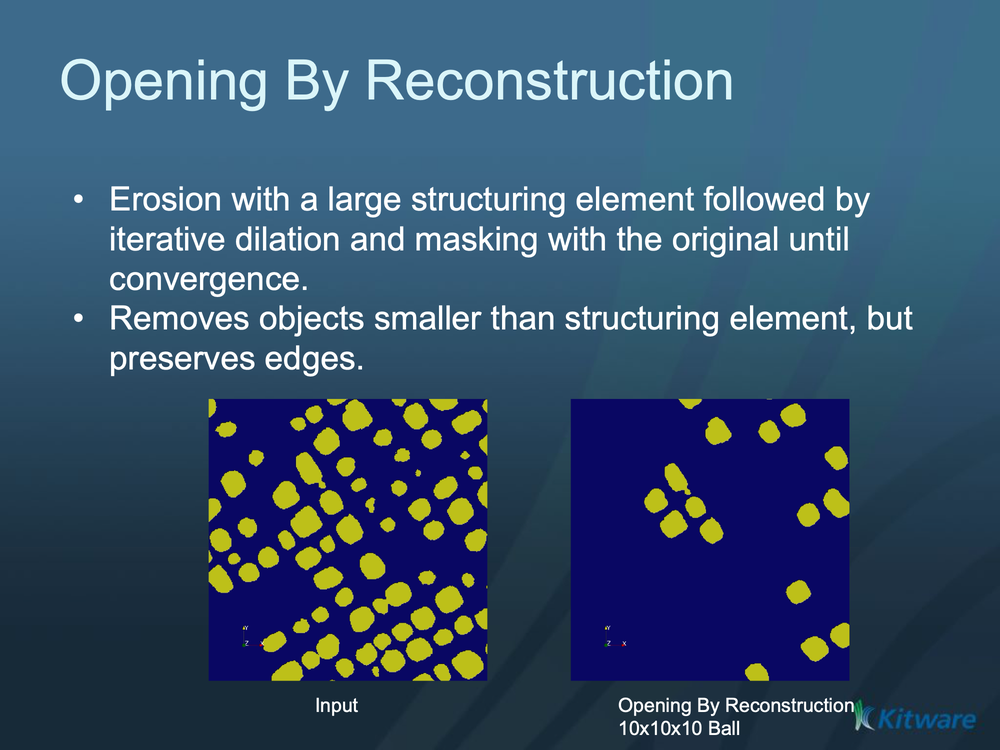

# ITK Binary Opening By Reconstruction Image Filter

Binary morphological opening by reconstruction of an image.

## Group (Subgroup)

ITKBinaryMathematicalMorphology (BinaryMathematicalMorphology)

## Description

This filter removes small (i.e., smaller than the structuring element) objects in the image. It is defined as: Opening(f) = ReconstructionByDilatation(Erosion(f)).

The structuring element is assumed to be composed of binary values (zero or one). Only elements of the structuring element having values > 0 are candidates for affecting the center pixel.

### Author

 Gaetan Lehmann. Biologie du Developpement et de la Reproduction, INRA de Jouy-en-Josas, France.

### Related Filters

This implementation was taken from the Insight Journal paper: <https://www.insight-journal.org/browse/publication/176> * MorphologyImageFilter , OpeningByReconstructionImageFilter , BinaryClosingByReconstructionImageFilter

### Kernel Type

The *Kernel Type* parameter selects the structuring element used for the morphological operation:

- **Annulus**: A ring-shaped structuring element.
- **Ball**: A spherical structuring element (default). Most commonly used for general morphological operations.
- **Box**: A rectangular/cuboid structuring element.
- **Cross**: A cross-shaped structuring element.

% Auto generated parameter table will be inserted here

## Example Pipelines

## License & Copyright

Please see the description file distributed with this plugin.

## DREAM3D-NX Help

If you need help, need to file a bug report or want to request a new feature, please head over to the [DREAM3DNX-Issues](https://github.com/BlueQuartzSoftware/DREAM3DNX-Issues/discussions) GitHub site where the community of DREAM3D-NX users can help answer your questions.
