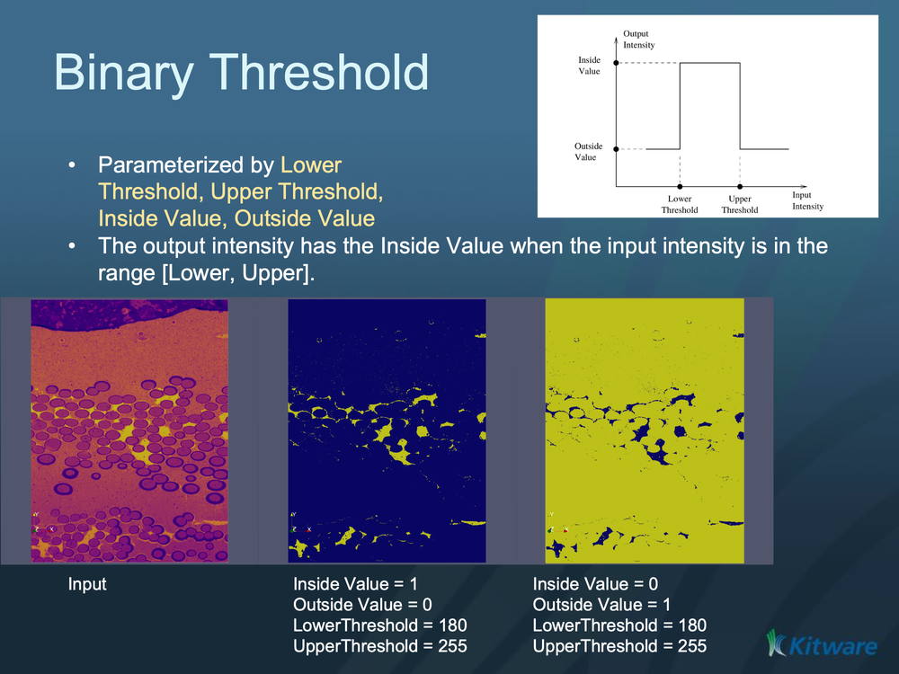

# ITK Binary Threshold Image Filter

Binarize an input image by thresholding.

## Group (Subgroup)

ITKThresholding (Thresholding)

## Description

This filter produces an output image whose pixels are either one of two values ( OutsideValue or InsideValue ), depending on whether the corresponding input image pixels lie between the two thresholds ( LowerThreshold and UpperThreshold ). Values equal to either threshold is considered to be between the thresholds.

More precisely \f[ Output(x_i) = \begin{cases} InsideValue & \text{if \f$LowerThreshold \leq x_i \leq UpperThreshold\f$} \\ OutsideValue & \text{otherwise} \end{cases} \f]

This filter is templated over the input image type and the output image type.

The filter expect both images to have the same number of dimensions.

The default values for LowerThreshold and UpperThreshold are: LowerThreshold = NumericTraits<TInput>::NonpositiveMin() ; UpperThreshold = NumericTraits<TInput>::max() ; Therefore, generally only one of these needs to be set, depending on whether the user wants to threshold above or below the desired threshold.

Set the thresholds. The default lower threshold is NumericTraits<InputPixelType>::NonpositiveMin() . The default upper threshold is NumericTraits<InputPixelType>::max . An exception is thrown if the lower threshold is greater than the upper threshold.

% Auto generated parameter table will be inserted here

## Example Pipelines

## License & Copyright

Please see the description file distributed with this plugin.

## DREAM3D-NX Help

If you need help, need to file a bug report or want to request a new feature, please head over to the [DREAM3DNX-Issues](https://github.com/BlueQuartzSoftware/DREAM3DNX-Issues/discussions) GitHub site where the community of DREAM3D-NX users can help answer your questions.
