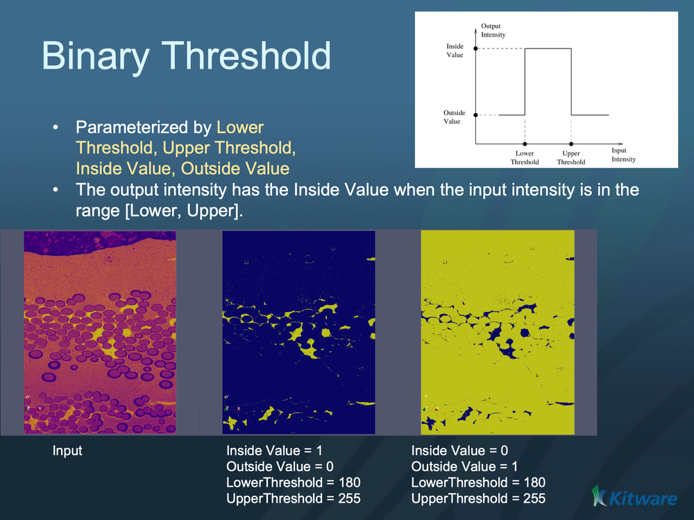

# ITK Binary Threshold Image Filter

Produces a two-value (binary) image by marking pixels whose intensity falls inside a chosen range.

## Group (Subgroup)

ITKThresholding (Thresholding)

## Description

This filter binarizes an image. Every pixel whose value lies **between the Lower Threshold and Upper Threshold (inclusive)** is set to the *Inside Value*; every other pixel is set to the *Outside Value*:

$$
\text{output}(x) = \begin{cases} \text{InsideValue} & \text{if } \text{LowerThreshold} \le x \le \text{UpperThreshold} \\ \text{OutsideValue} & \text{otherwise} \end{cases}
$$

### Parameter Guidance

- **Lower Threshold** / **Upper Threshold** — the bounds of the "inside" range, in the **input image's intensity units**. By default the lower bound is the smallest possible pixel value and the upper bound is the largest, so the range spans everything; in practice you usually set only one of the two — a lower bound to keep everything *above* a value, or an upper bound to keep everything *below* a value.
- **Inside Value** — the output value written for pixels inside the range (a `uint8` label, default *1*).
- **Outside Value** — the output value written for pixels outside the range (a `uint8` label, default *0*).

### Required Input Sources

Operates on any scalar image — typically from [Read Image](../SimplnxCore/ReadImageFilter.md), [Read Images [3D Stack]](../SimplnxCore/ReadImageStackFilter.md), or the output of a prior ITK image filter.

% Auto generated parameter table will be inserted here

## Example Pipelines

## License & Copyright

Please see the description file distributed with this **Plugin**

## DREAM3D-NX Help

If you need help, need to file a bug report or want to request a new feature, please head over to the [DREAM3DNX-Issues](https://github.com/BlueQuartzSoftware/DREAM3DNX-Issues/discussions) GitHub site where the community of DREAM3D-NX users can help answer your questions.
