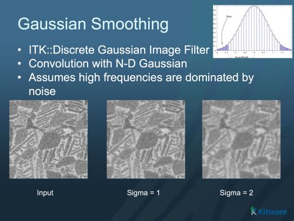

# ITK Discrete Gaussian Image Filter

Blurs an image by separable convolution with discrete gaussian kernels. This filter performs Gaussian blurring by separable convolution of an image and a discrete Gaussian operator (kernel).

## Group (Subgroup)

ITKSmoothing (Smoothing)

## Description

The Gaussian operator used here was described by Tony Lindeberg (Discrete Scale-Space Theory and the Scale-Space Primal Sketch. Dissertation. Royal Institute of Technology, Stockholm, Sweden. May 1991.) The Gaussian kernel used here was designed so that smoothing and derivative operations commute after discretization.

The variance or standard deviation (sigma) will be evaluated as pixel units if SetUseImageSpacing is off (false) or as physical units if SetUseImageSpacing is on (true, default). The variance can be set independently in each dimension.

When the Gaussian kernel is small, this filter tends to run faster than itk::RecursiveGaussianImageFilter .* GaussianOperator

- Image
- Neighborhood
- NeighborhoodOperator
- RecursiveGaussianImageFilter

% Auto generated parameter table will be inserted here

## Example Pipelines

## License & Copyright

Please see the description file distributed with this plugin.

## DREAM3D-NX Help

If you need help, need to file a bug report or want to request a new feature, please head over to the [DREAM3DNX-Issues](https://github.com/BlueQuartzSoftware/DREAM3DNX-Issues/discussions) GitHub site where the community of DREAM3D-NX users can help answer your questions.
