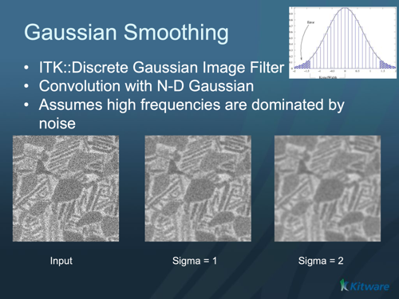

# ITK Discrete Gaussian Image Filter

Blurs an image with a Gaussian kernel — the standard linear smoothing/denoising operation.

## Group (Subgroup)

ITKSmoothing (Smoothing)

## Description

This filter applies **Gaussian blurring**: each pixel is replaced by a weighted average of its neighborhood, with the weights following a bell-shaped (Gaussian) curve so nearby pixels count more than distant ones. It is the most common general-purpose smoothing/denoising filter. The blur is performed efficiently as a separable convolution and can be set independently per axis.

A faster alternative for large blur widths is a recursive-Gaussian (IIR) smoother, whose run time does not grow with the blur size.

### Parameter Guidance

- **Variance** — the blur strength per axis. Note this is the **variance (sigma squared)**, *not* sigma itself — a common point of confusion. Larger values blur more. Units are **pixels²** when *Use Image Spacing* is off, or **physical units²** when it is on. Typical values are around 1.0-4.0 px².
- **Use Image Spacing** — when on (default), the variance is interpreted in the geometry's physical units; when off, in pixels.
- **Maximum Kernel Width** — the largest kernel size, in **pixels**, the filter is allowed to build. It caps memory/time for very large variances.
- **Maximum Error** — the maximum allowed approximation error of the discrete Gaussian (per axis), a small dimensionless tolerance.

### Required Input Sources

Operates on any scalar image — typically from [Read Image](../SimplnxCore/ReadImageFilter.md), [Read Images [3D Stack]](../SimplnxCore/ReadImageStackFilter.md), or the output of a prior ITK image filter.

## Reference

T. Lindeberg, *Discrete Scale-Space Theory and the Scale-Space Primal Sketch*, Dissertation, Royal Institute of Technology, Stockholm, May 1991.

% Auto generated parameter table will be inserted here

## Example Pipelines

## License & Copyright

Please see the description file distributed with this **Plugin**

## DREAM3D-NX Help

If you need help, need to file a bug report or want to request a new feature, please head over to the [DREAM3DNX-Issues](https://github.com/BlueQuartzSoftware/DREAM3DNX-Issues/discussions) GitHub site where the community of DREAM3D-NX users can help answer your questions.
