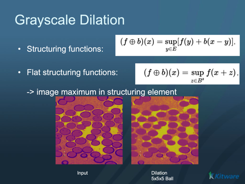

# ITK Grayscale Dilate Image Filter

Grayscale dilation of an image.

## Group (Subgroup)

ITKMathematicalMorphology (MathematicalMorphology)

## Description

Dilate an image using grayscale morphology. Dilation takes the maximum of all the pixels identified by the structuring element.

The structuring element is assumed to be composed of binary values (zero or one). Only elements of the structuring element having values > 0 are candidates for affecting the center pixel.* MorphologyImageFilter , GrayscaleFunctionDilateImageFilter , BinaryDilateImageFilter

% Auto generated parameter table will be inserted here

## Example Pipelines

## License & Copyright

Please see the description file distributed with this plugin.

## DREAM3D-NX Help

If you need help, need to file a bug report or want to request a new feature, please head over to the [DREAM3DNX-Issues](https://github.com/BlueQuartzSoftware/DREAM3DNX-Issues/discussions) GitHub site where the community of DREAM3D-NX users can help answer your questions.
