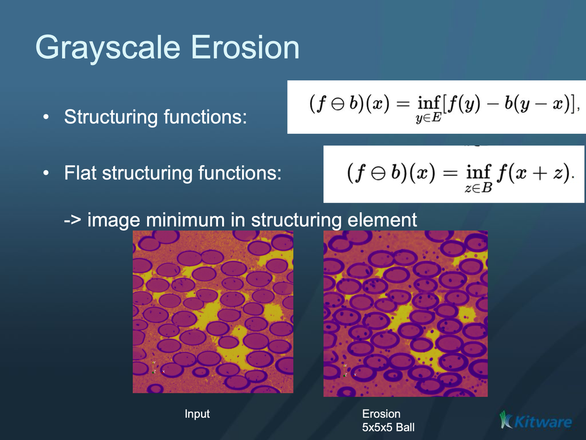

# ITK Grayscale Erode Image Filter

Replaces each pixel with the minimum value in its neighborhood — a grayscale erosion that darkens the image and grows dark regions.

## Group (Subgroup)

ITKMathematicalMorphology (MathematicalMorphology)

## Description

Grayscale **erosion** replaces each pixel with the **minimum** value found within the neighborhood defined by the **structuring element** (the probe shape — ball, box, etc. — swept over the image). The effect is to darken the image, grow dark regions, and shrink bright ones. It is the grayscale counterpart of binary erosion and the dual of [ITK Grayscale Dilate Image Filter](ITKGrayscaleDilateImageFilter.md).

### Parameter Guidance

- **Kernel Radius** — the radius of the structuring element, **in pixels** (one value per axis). Larger radii grow dark regions more.

#### Kernel Type

The *Kernel Type* parameter selects the structuring element shape:

- **Annulus [0]**: A ring-shaped structuring element.
- **Ball [1]**: A spherical structuring element (default). Most commonly used for general morphological operations.
- **Box [2]**: A rectangular/cuboid structuring element.
- **Cross [3]**: A cross-shaped structuring element.

### Required Input Sources

Operates on any scalar (grayscale) image — typically from [Read Image](../SimplnxCore/ReadImageFilter.md), [Read Images [3D Stack]](../SimplnxCore/ReadImageStackFilter.md), or the output of a prior ITK image filter.

% Auto generated parameter table will be inserted here

## Example Pipelines

## License & Copyright

Please see the description file distributed with this **Plugin**

## DREAM3D-NX Help

If you need help, need to file a bug report or want to request a new feature, please head over to the [DREAM3DNX-Issues](https://github.com/BlueQuartzSoftware/DREAM3DNX-Issues/discussions) GitHub site where the community of DREAM3D-NX users can help answer your questions.
