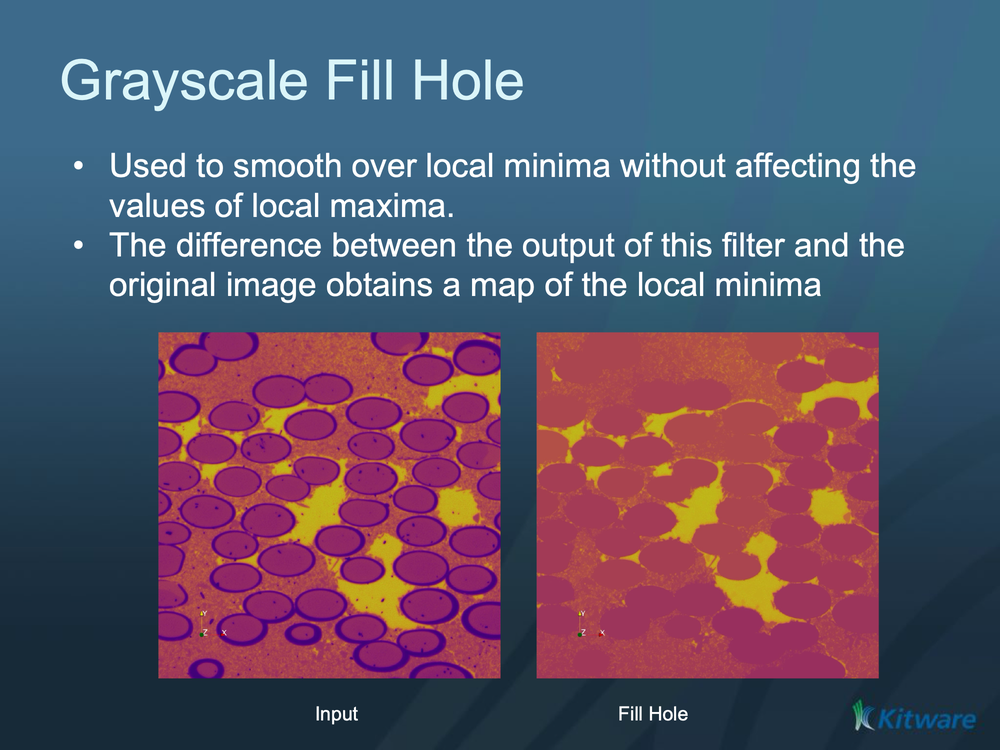

# ITK Grayscale Fillhole Image Filter

Fills dark "holes" in a grayscale image — enclosed dark spots that are not connected to the image border.

## Group (Subgroup)

ITKMathematicalMorphology (MathematicalMorphology)

## Description

This filter fills **holes** in a grayscale image. A hole is a local minimum (a dark spot) that is fully enclosed by brighter pixels and not connected to the image border. The filter raises each hole up to the gray level of the surrounding pixels, smoothing over dark spots while leaving bright features (local maxima) untouched.

A useful trick: subtract the original image from this filter's output (and optionally threshold the difference) to obtain a map of the dark spots that were filled. The dual operation, which removes bright peaks instead, is [ITK Grayscale Grind Peak Image Filter](ITKGrayscaleGrindPeakImageFilter.md).

### Parameter Guidance

- **Fully Connected** — controls neighbor connectivity when deciding whether a region is "enclosed" (face-only versus face + edge + corner). Turn it on for thin, one-pixel-wide structures.

### Required Input Sources

Operates on any scalar (grayscale) image — typically from [Read Image](../SimplnxCore/ReadImageFilter.md), [Read Images [3D Stack]](../SimplnxCore/ReadImageStackFilter.md), or the output of a prior ITK image filter.

## Reference

Pierre Soille, *Morphological Image Analysis: Principles and Applications*, Second Edition, Springer, 2003 (Chapter 6).

% Auto generated parameter table will be inserted here

## Example Pipelines

## License & Copyright

Please see the description file distributed with this **Plugin**

## DREAM3D-NX Help

If you need help, need to file a bug report or want to request a new feature, please head over to the [DREAM3DNX-Issues](https://github.com/BlueQuartzSoftware/DREAM3DNX-Issues/discussions) GitHub site where the community of DREAM3D-NX users can help answer your questions.
