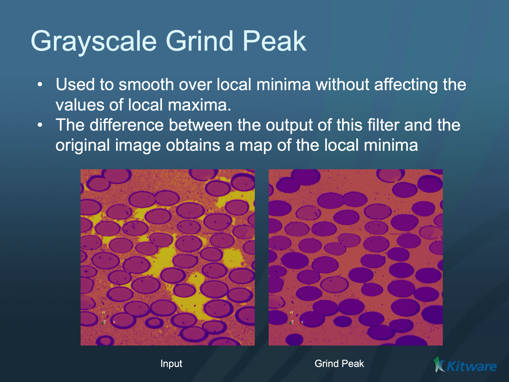

# ITK Grayscale Grind Peak Image Filter

Removes bright "peaks" from a grayscale image — enclosed bright spots that are not connected to the image border.

## Group (Subgroup)

ITKMathematicalMorphology (MathematicalMorphology)

## Description

This filter removes **peaks** in a grayscale image. A peak is a local maximum (a bright spot) that is fully enclosed by darker pixels and not connected to the image border. The filter lowers each peak down to the gray level of the surrounding pixels, smoothing over bright spots while leaving dark features (local minima) untouched. It is the exact dual of [ITK Grayscale Fillhole Image Filter](ITKGrayscaleFillholeImageFilter.md).

A useful trick: subtract this filter's output from the original image (and optionally threshold the difference) to obtain a map of the bright spots that were removed.

### Parameter Guidance

- **Fully Connected** — controls neighbor connectivity when deciding whether a region is "enclosed" (face-only versus face + edge + corner). Turn it on for thin, one-pixel-wide structures.

### Required Input Sources

Operates on any scalar (grayscale) image — typically from [Read Image](../SimplnxCore/ReadImageFilter.md), [Read Images [3D Stack]](../SimplnxCore/ReadImageStackFilter.md), or the output of a prior ITK image filter.

## Reference

Pierre Soille, *Morphological Image Analysis: Principles and Applications*, Second Edition, Springer, 2003 (Chapter 6).

% Auto generated parameter table will be inserted here

## Example Pipelines

## License & Copyright

Please see the description file distributed with this **Plugin**

## DREAM3D-NX Help

If you need help, need to file a bug report or want to request a new feature, please head over to the [DREAM3DNX-Issues](https://github.com/BlueQuartzSoftware/DREAM3DNX-Issues/discussions) GitHub site where the community of DREAM3D-NX users can help answer your questions.
