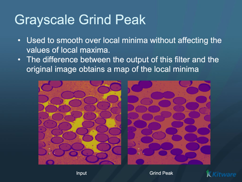

# ITK Grayscale Grind Peak Image Filter

Remove local maxima not connected to the boundary of the image.

## Group (Subgroup)

ITKMathematicalMorphology (MathematicalMorphology)

## Description

GrayscaleGrindPeakImageFilter removes peaks in a grayscale image. Peaks are local maxima in the grayscale topography that are not connected to boundaries of the image. Gray level values adjacent to a peak are extrapolated through the peak.

This filter is used to smooth over local maxima without affecting the values of local minima. If you take the difference between the output of this filter and the original image (and perhaps threshold the difference above a small value), you'll obtain a map of the local maxima.

This filter uses the GrayscaleGeodesicDilateImageFilter . It provides its own input as the "mask" input to the geodesic erosion. The "marker" image for the geodesic erosion is constructed such that boundary pixels match the boundary pixels of the input image and the interior pixels are set to the minimum pixel value in the input image.

This filter is the dual to the GrayscaleFillholeImageFilter which implements the Fillhole algorithm. Since it is a dual, it is somewhat superfluous but is provided as a convenience.

Geodesic morphology and the Fillhole algorithm is described in Chapter 6 of Pierre Soille's book "Morphological Image Analysis:
Principles and Applications", Second Edition, Springer, 2003.* GrayscaleGeodesicDilateImageFilter

- MorphologyImageFilter , GrayscaleDilateImageFilter , GrayscaleFunctionDilateImageFilter , BinaryDilateImageFilter

% Auto generated parameter table will be inserted here

## Example Pipelines

## License & Copyright

Please see the description file distributed with this plugin.

## DREAM3D-NX Help

If you need help, need to file a bug report or want to request a new feature, please head over to the [DREAM3DNX-Issues](https://github.com/BlueQuartzSoftware/DREAM3DNX-Issues/discussions) GitHub site where the community of DREAM3D-NX users can help answer your questions.
