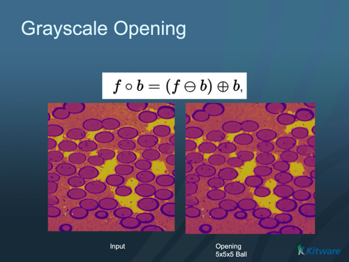

# ITK Grayscale Morphological Opening Image Filter

Removes small bright features from a grayscale image (a grayscale erosion followed by a dilation).

## Group (Subgroup)

ITKMathematicalMorphology (MathematicalMorphology)

## Description

Grayscale **opening** is an **erosion followed by a dilation** using the same structuring element. It removes small **bright** features — small bright spots, thin bright lines, and narrow bright protrusions smaller than the **structuring element** (the probe shape swept over the image) — while leaving the overall brightness and larger structures essentially unchanged. The dual operation, [ITK Grayscale Morphological Closing Image Filter](ITKGrayscaleMorphologicalClosingImageFilter.md), removes small dark features instead.

### Parameter Guidance

- **Kernel Radius** — the radius of the structuring element, **in pixels** (one value per axis). Bright features smaller than this are removed.
- **Safe Border** — when on (default), a temporary border is added during processing to avoid edge artifacts and removed afterward.

#### Kernel Type

The *Kernel Type* parameter selects the structuring element shape:

- **Annulus [0]**: A ring-shaped structuring element.
- **Ball [1]**: A spherical structuring element (default). Most commonly used for general morphological operations.
- **Box [2]**: A rectangular/cuboid structuring element.
- **Cross [3]**: A cross-shaped structuring element.

### Required Input Sources

Operates on any scalar (grayscale) image — typically from [Read Image](../SimplnxCore/ReadImageFilter.md), [Read Images [3D Stack]](../SimplnxCore/ReadImageStackFilter.md), or the output of a prior ITK image filter.

% Auto generated parameter table will be inserted here

## Example Pipelines

## License & Copyright

Please see the description file distributed with this **Plugin**

## DREAM3D-NX Help

If you need help, need to file a bug report or want to request a new feature, please head over to the [DREAM3DNX-Issues](https://github.com/BlueQuartzSoftware/DREAM3DNX-Issues/discussions) GitHub site where the community of DREAM3D-NX users can help answer your questions.
