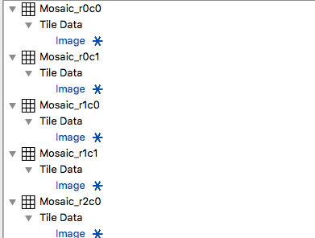

# Import Fiji Montage #

## Group (Subgroup) ##

Import/Export (Import)

## Description ##

Imports multiple images for the purpose of montage assembly. Each image is stored in it's own *DataContaner/AttributeMatrix/AttributeArray* where the name of the *DataContainer* is based off the row & column index of the montage. The filter assumes that the Configuration File is in the same folder as the images. The created *AttributeMatrix* and *AttributeArray* will have the same name. The image files **MUST** be located in the same directory as the Fiji Configuration File.

Utilizes the *itkReadImage* and *ColorToGrayScale* filters

## Example Registration File ##

    # Define the number of dimensions we are working on
    dim = 2                         <===== THIS LINE IS REQUIRED

    # Define the image coordinates  <===== THIS LINE IS REQUIRED
    SampleMosaic_p0.bmp; ; (0, 0)
    SampleMosaic_p1.bmp; ; (1227.55, 0)
    SampleMosaic_p3.bmp; ; (0.23675, 920.01)
    SampleMosaic_p2.bmp; ; (1227.55, 919.774)
    SampleMosaic_p4.bmp; ; (0.23675, 1839.55)
    SampleMosaic_p5.bmp; ; (1227.31, 1839.55)

The configuration above would result in a data structure as shown in the following image:

## Parameters ##

| Name             | Type | Comment |
|------------------|------|---------|
| Input Fiji Tile Configuration File | String | |
| Name of Created Montage | String | Used for the montage infrastructure |
| Montage Column Start/End | Int x 2 | The starting and ending column (inclusive) that will be imported |
| Montage Row Start/End | Int x 2 | The starting and ending column (inclusive) that will be imported |
| Length Unit | Int | Selected from predefined list. See table below |
| Change Origin | Bool = OFF | Set the origin of the mosaic to a user defined value |
| Origin | Float 3 Vect | The new origin of the mosaic |
| Convert to GrayScale | Bool | The filter will show an error if the images are already in grayscale format |
| Color Weighting | Float 3 Vect | The luminosity values for the conversion || Data Container Prefix | String  | A prefix that can be used for each data container.  |
| Cell Attribute Matrix Name | String  | The name of the Cell Attribute Matrix. |
| Image Data Array Name | String  | The name of the import image data |

### Color To Gray Scale Notes ###

The luminosity method is a more sophisticated version of the average method. It also averages the values, but it forms a weighted average to account for human perception. We re more sensitive to green than other colors, so green is weighted most heavily. The default formula for luminosity is BT709 Gray scale:

    Red: 0.2125 Green: 0.7154 Blue: 0.0721. 

The user can set the weightings to what ever values they would like.

### Lenght Unit ###

    Yoctometer = 0
    Zeptometer = 1
    Attometer = 2
    Femtometer = 3
    Picometer = 4
    Nanometer = 5
    Micrometer = 6
    Millimeter = 7
    Centimeter = 8
    Decimeter = 9
    Meter = 10
    Decameter = 11
    Hectometer = 12
    Kilometer = 13
    Megameter = 14
    Gigameter = 15
    Terameter = 16
    Petameter = 17
    Exameter = 18
    Zettameter = 19
    Yottameter = 20
    Angstrom = 21
    Mil = 22
    Inch = 23
    Foot = 24
    Mile = 25
    Fathom = 26
    Unspecified = 100U
    Unknown = 101U

## Required DataContainers ##

NONE

## Required Objects ##

NONE

## Created Objects ##

This filter will create one data container for each image tile that is in the xml file. That created Data Container will have a Cell Attribute Matrix which will also hold a single Attribute Array of the same type of the image (unless the user selects to convert images to Gray Scale images.)

| Kind | Default Name | Type | Component Dimensions | Description |
|------|--------------|------|----------------------|-------------|
| **Data Container** | Data Container Name | N/A | N/A |  |
| ImageGeometry |  | N/A | N/A |  |
| Cell AttributeMatrix |  | N/A | N/A |  |
| Image Data |  | N/A | N/A |  |

## Authors ##

**Contact Info** <dream3d@bluequartz.net>

**Version** 1.0.0

**License**  See the License.txt file that came with DREAM3D.

## Example Pipelines ##

Prebuilt Pipelines / Examples / ITKImageProcessing / Fiji Import

## License & Copyright ##

Please see the description file distributed with this plugin.

## DREAM3D Mailing Lists ##

If you need more help with a filter, please consider asking your question on the DREAM3D Users mailing list:
<https://groups.google.com/forum/?hl=en#!forum/dream3d-users>
