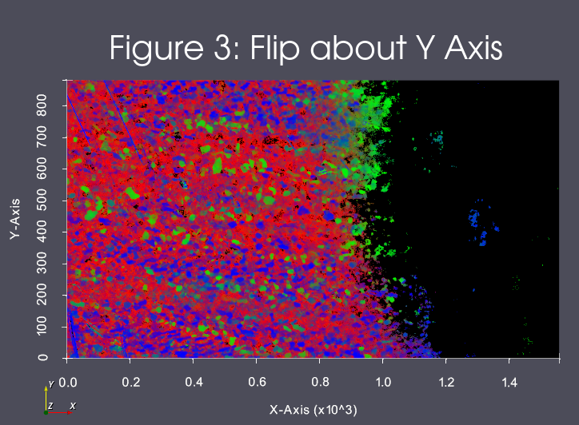

# ITK::Import Images (3D Stack)

This filter directly wraps an ITK filter of the same name.

## Group (Subgroup)

ITKImageProcessing (ITKImageProcessing)

## Description

Read in a stack of 2D images and stack the images into a 3D Volume using the ITK library. Supports most common scalar pixel types and the many file formats supported by ITK.
The filter will create a new Image Geometry. The user can specify a value for the origin and the spacing if the defaults are not appropriate. The default value for the origin will be at (0, 0, 0) and the default spacing value will be (1.0, 1.0, 1.0). If the user needs to have the create Image Geometry located in a different location in the global reference frame, the user can change the default origin value. The "origin" of the image is at a normal Cartesian style origin.

## Image Operations

The user can select to flip the images about the X or Y Axis during import. The result of these
operations can be seen in Figures 1, 2 and 3

% Auto generated parameter table will be inserted here

## Example Pipelines

- (08) Image Initial Visualization
- (09) Image Segmentation

## License & Copyright

Please see the description file distributed with this plugin.

## DREAM3D-NX Help

If you need help, need to file a bug report or want to request a new feature, please head over to the [DREAM3DNX-Issues](https://github.com/BlueQuartzSoftware/DREAM3DNX-Issues/discussions) GItHub site where the community of DREAM3D-NX users can help answer your questions.
