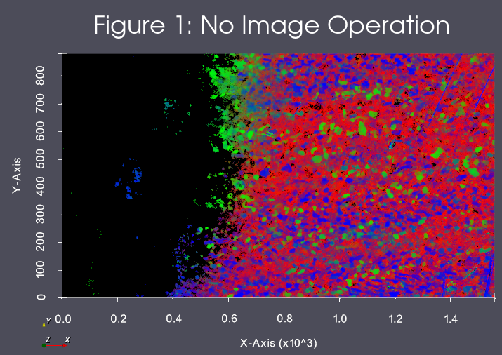
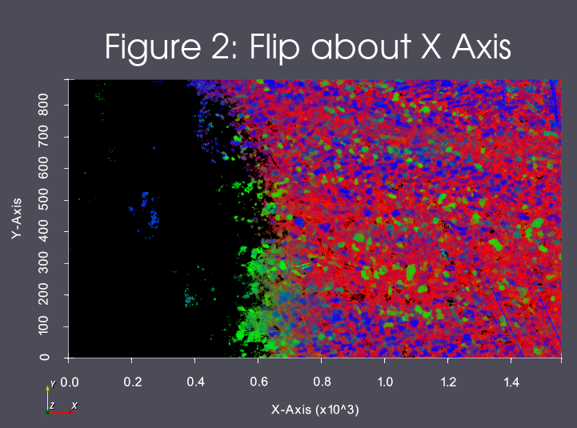
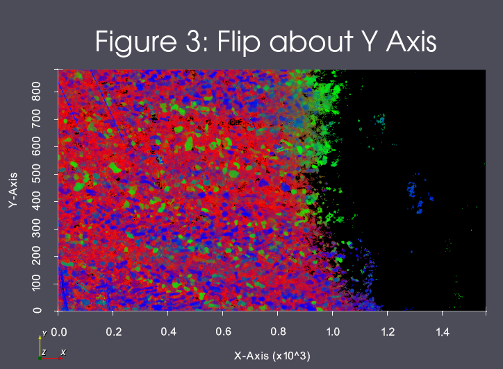

# Read Images [3D Stack] (ITK)

This filter directly wraps an ITK filter of the same name.

## Group (Subgroup)

ITKImageProcessing (ITKImageProcessing)

## Description

Read in a stack of 2D images and stack the images into a 3D Volume using the ITK library. Supports most common scalar pixel types and the many file formats supported by ITK.
The filter will create a new Image Geometry. The user can specify a value for the origin and the spacing if the defaults are not appropriate. The default value for the origin will be at (0, 0, 0) and the default spacing value will be (1.0, 1.0, 1.0). If the user needs to have the create Image Geometry located in a different location in the global reference frame, the user can change the default origin value. The "origin" of the image is at a normal Cartesian style origin.
The user can decide to scale the images as they are being read in by turning on the Scale Images option, and setting a scale value.  A scale value of 10.0 resamples the images in the stack to one-tenth the number of pixels, a scale value of 200.0 resamples the images in the stack to double the number of pixels.  The default scale value is 100.0.

## Image Operations

The user can select to flip the images about the X or Y Axis during import. The result of these
operations can be seen in Figures 1, 2 and 3

% Auto generated parameter table will be inserted here

## Note on Resampling

The optional resampling parameter has two options that affect the output image and size of the resulting geometry.

- Scaling Factor (1) - This is the scaling option that previously existed with the filter. It functions by providing a float value that becomes a XYZ scaling factor vector that is applied to each image before it is inserted into the final geometry. This means that the number of pixels in the resulting output image will be resampled to `{X * (ScalingFactor / 100.0), Y * (ScalingFactor / 100.0), Number of Images In Stack} (XYZ)`. This means that a value of 100 (Like 100%) will *NOT* perform any resampling. A value of 50 will produce a final output image that has half as many pixels along the X and Y Axis. A value of 200 will have twice as many voxels along the X and Y Axis.
- Exact XY Dimensions (2) - This is provided to allow for precision resampling along the Z Axis. The number of pixels in the resulting output image will be resampled to `{User Supplied X, User Supplied Y, Number of Images In Stack} (XYZ)`.

Both options are different ways to parameterize the resampling functionality. The main difference should be that `Scaling Factor (1)` is implicity uniform in its resampling across the X and Y dimensions, but the same is not true for `Exact XY Dimensions (2)`.

## Example Pipelines

- (08) Image Initial Visualization
- (09) Image Segmentation

## License & Copyright

Please see the description file distributed with this plugin.

## DREAM3D-NX Help

If you need help, need to file a bug report or want to request a new feature, please head over to the [DREAM3DNX-Issues](https://github.com/BlueQuartzSoftware/DREAM3DNX-Issues/discussions) GitHub site where the community of DREAM3D-NX users can help answer your questions.
