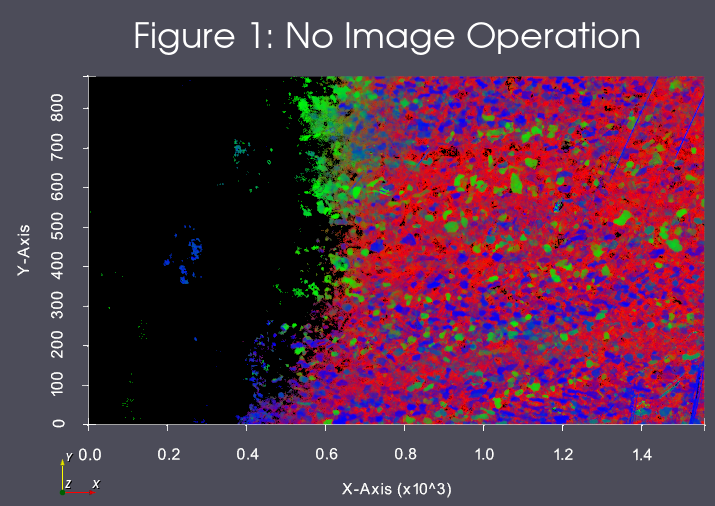
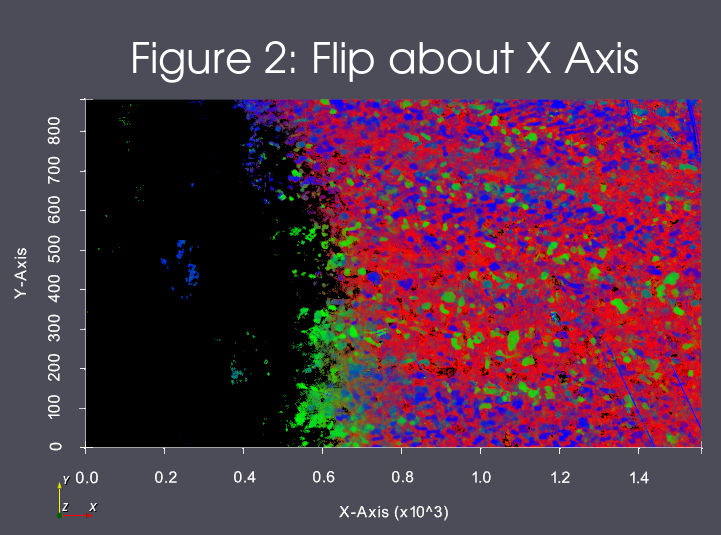
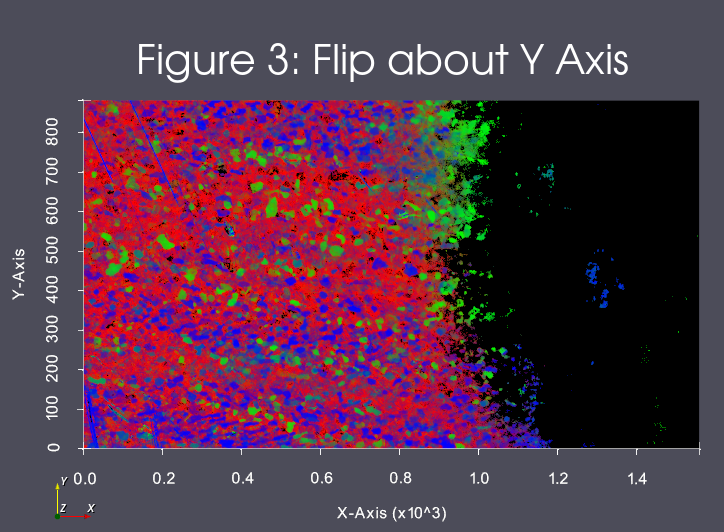

# Read Images [3D Stack] (ITK)

Reads a stack of 2D images and assembles them into a 3D Image Geometry using the ITK library.

## Group (Subgroup)

ITKImageProcessing (ITKImageProcessing)

## Description

Read in a stack of 2D images and stack the images into a 3D Volume using the ITK library. Supports most common scalar pixel types and the many file formats supported by ITK.

This filter shares its human name with the SimplnxCore [Read Images [3D Stack]](../SimplnxCore/ReadImageStackFilter.md) filter. This ITK-based variant supports the broader range of file formats handled by ITK along with additional cropping, resampling, and data-type conversion options.

### Processing Order

Image operations are applied in the following order:
1. Read image
2. Crop image
3. Resample image
4. Convert to grayscale
5. Flip image in X or Y

### Origin & Spacing Caveats

The filter will create a new Image Geometry. The user can optionally override the origin and spacing for the created geometry. The default values from the input files will be used unless the user explicitly enables the "Set Origin" and/or "Set Spacing" options. If the user needs to have the created Image Geometry located in a different location in the global reference frame, the user can change the default origin value. The "origin" of the image is at a normal Cartesian style origin.

When setting a custom origin, the user can choose whether to place the origin at the corner of the geometry (default) or at the center of the geometry.

### Origin & Spacing Processing

The *Origin & Spacing Processing* parameter provides the following choices:

- **Preprocessed [0]**: Origin and spacing overrides are applied before the image cropping step.
- **Postprocessed [1]**: Origin and spacing overrides are applied after the image flipping step.

When **Preprocessed** is selected, the processing order becomes:

1. Read image
2. Set origin and spacing values
3. Crop image
4. Resample image
5. Convert to grayscale
6. Flip image in X or Y

When **Postprocessed** is selected, the processing order becomes:

1. Read image
2. Crop image
3. Resample image
4. Convert to grayscale
5. Flip image in X or Y
6. Set origin and spacing values

### Resampling Caveats

The user can decide to scale the images as they are being read in by turning on the Scale Images option, and setting a scale value. A scale value of 10.0 resamples the images in the stack to one-tenth the number of pixels, a scale value of 200.0 resamples the images in the stack to double the number of pixels. The default scale value is 100.0.

### Output Data Type

The *Output Data Type* parameter provides the following choices:

- **uint8 [0]**: Convert image data to 8-bit unsigned integer.
- **uint16 [1]**: Convert image data to 16-bit unsigned integer.
- **uint32 [2]**: Convert image data to 32-bit unsigned integer.

### Data Type Conversion

The user can optionally convert the image data to a different data type by enabling the "Set Image Data Type" option.

### Cropping Caveats

The user can crop the incoming image geometry using the Cropping Options section. The cropping type options are:
- **No Cropping**: Read the full volume into an image geometry
- **Voxel Subvolume**: Read a subvolume into an image geometry using voxel coordinates
- **Physical Subvolume**: Read a subvolume into an image geometry using physical coordinates

Both subvolume cropping types have checkboxes to turn on/off cropping in each of the X, Y, and Z dimensions. For example, if **Physical Subvolume** is selected, **Crop Y Dimension** is enabled, and **Crop X Dimension** and **Crop Z Dimension** are disabled, then the incoming volume will be cropped in the Y dimension only and the cropping bounds will be in physical units.

## Image Operations

The user can select to flip the images about the X or Y Axis during import. The result of these
operations can be seen in Figures 1, 2 and 3

% Auto generated parameter table will be inserted here

## Note on Resampling

The optional resampling parameter has two options that affect the output image and size of the resulting geometry.

- Scaling Factor (1) - This is the scaling option that previously existed with the filter. It functions by providing a float value that becomes a XYZ scaling factor vector that is applied to each image before it is inserted into the final geometry. This means that the number of pixels in the resulting output image will be resampled to `{X * (ScalingFactor / 100.0), Y * (ScalingFactor / 100.0), Number of Images In Stack} (XYZ)`. This means that a value of 100 (Like 100%) will *NOT* perform any resampling. A value of 50 will produce a final output image that has half as many pixels along the X and Y Axis. A value of 200 will have twice as many voxels along the X and Y Axis.
- Exact XY Dimensions (2) - This is provided to allow for precision resampling along the Z Axis. The number of pixels in the resulting output image will be resampled to `{User Supplied X, User Supplied Y, Number of Images In Stack} (XYZ)`.

Both options are different ways to parameterize the resampling functionality. The main difference should be that `Scaling Factor (1)` is implicity uniform in its resampling across the X and Y dimensions, but the same is not true for `Exact XY Dimensions (2)`.

## Example Pipelines

- (08) Image Initial Visualization
- (09) Image Segmentation

## License & Copyright

Please see the description file distributed with this plugin.

## DREAM3D-NX Help

If you need help, need to file a bug report or want to request a new feature, please head over to the [DREAM3DNX-Issues](https://github.com/BlueQuartzSoftware/DREAM3DNX-Issues/discussions) GitHub site where the community of DREAM3D-NX users can help answer your questions.
