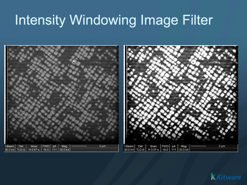

# ITK Intensity Windowing Image Filter

Applies a linear transformation to the intensity levels of the input Image that are inside a user-defined interval. Values below this interval are mapped to a constant. Values over the interval are mapped to another constant.

## Group (Subgroup)

ITKImageIntensity (ImageIntensity)

## Description

IntensityWindowingImageFilter applies pixel-wise a linear transformation to the intensity values of input image pixels. The linear transformation is defined by the user in terms of the minimum and maximum values that the output image should have and the lower and upper limits of the intensity window of the input image. This operation is very common in visualization, and can also be applied as a convenient preprocessing operation for image segmentation.

All computations are performed in the precision of the input pixel's RealType. Before assigning the computed value to the output pixel.* RescaleIntensityImageFilter

% Auto generated parameter table will be inserted here

## Example Pipelines

## License & Copyright

Please see the description file distributed with this plugin.

## DREAM3D-NX Help

If you need help, need to file a bug report or want to request a new feature, please head over to the [DREAM3DNX-Issues](https://github.com/BlueQuartzSoftware/DREAM3DNX-Issues/discussions) GItHub site where the community of DREAM3D-NX users can help answer your questions.
