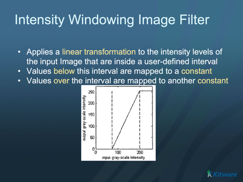
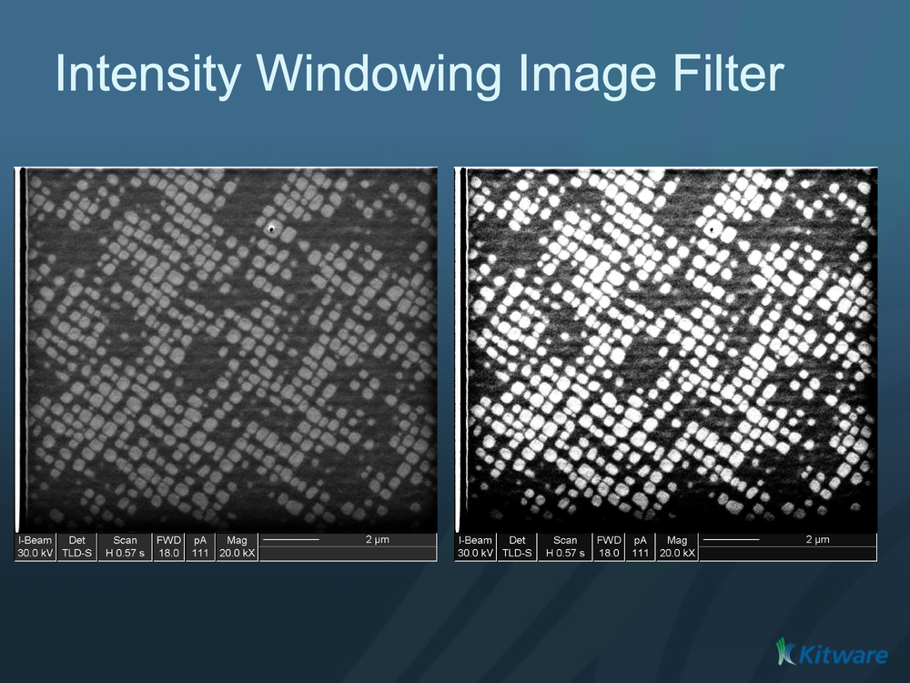

# ITK Intensity Windowing Image Filter

Linearly stretches a chosen input intensity window into a target output range, clamping everything outside the window.

## Group (Subgroup)

ITKImageIntensity (ImageIntensity)

## Description

This filter remaps pixel intensities with a linear "window/level" transform, the operation behind most medical-image and CT contrast controls. Input values inside the window — between *Window Minimum* and *Window Maximum* — are stretched linearly to fill the output range *Output Minimum* to *Output Maximum*. Input values below the window are clamped to *Output Minimum*, and values above it are clamped to *Output Maximum*. It is commonly used for visualization and as a preprocessing step before segmentation.

To map the *full* input range automatically instead of a chosen window, use [ITK Rescale Intensity Image Filter](ITKRescaleIntensityImageFilter.md).

### Parameter Guidance

- **Window Minimum** / **Window Maximum** — the lower and upper bounds of the input intensity window of interest, in **input intensity units**. This window is what gets stretched.
- **Output Minimum** / **Output Maximum** — the target output range, in **output intensity units** (defaults *0* and *255*).

### Required Input Sources

Operates on any scalar image — typically from [Read Image](../SimplnxCore/ReadImageFilter.md), [Read Images [3D Stack]](../SimplnxCore/ReadImageStackFilter.md), or the output of a prior ITK image filter.

% Auto generated parameter table will be inserted here

## Example Pipelines

## License & Copyright

Please see the description file distributed with this **Plugin**

## DREAM3D-NX Help

If you need help, need to file a bug report or want to request a new feature, please head over to the [DREAM3DNX-Issues](https://github.com/BlueQuartzSoftware/DREAM3DNX-Issues/discussions) GitHub site where the community of DREAM3D-NX users can help answer your questions.
