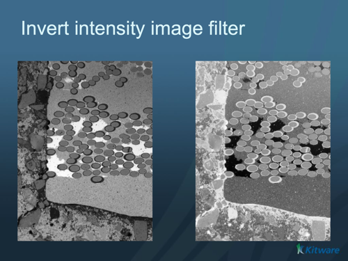

# ITK Invert Intensity Image Filter

Invert the intensity of an image.

## Group (Subgroup)

ITKImageIntensity (ImageIntensity)

## Description

Inverts the intensity of each pixel by computing `Maximum - pixel`. This filter can be used to invert, for example, a binary image, a distance map, etc.

### Parameter Guidance

- **Maximum**: The largest intensity value used as the reference for the inversion, in image intensity units. Set this to the largest intensity present in the data (for example, 255 for an 8-bit image).

% Auto generated parameter table will be inserted here

## Example Pipelines

## License & Copyright

Please see the description file distributed with this plugin.

## DREAM3D-NX Help

If you need help, need to file a bug report or want to request a new feature, please head over to the [DREAM3DNX-Issues](https://github.com/BlueQuartzSoftware/DREAM3DNX-Issues/discussions) GitHub site where the community of DREAM3D-NX users can help answer your questions.
