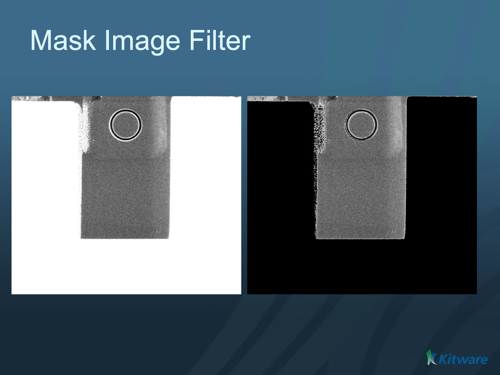

# ITK::Mask Image Filter

This filter directly wraps an ITK filter of the same name.

## Group (Subgroup)

ITKImageProcessing (ITKImageProcessing)

## Description

Mask an image with a mask.

This class is templated over the types of the input image type, the mask image type and the type of the output image. Numeric conversions (castings) are done by the C++ defaults.

The pixel type of the input 2 image must have a valid definition of the operator != with zero. This condition is required because internally this filter will perform the operation

```
-        if pixel_from_mask_image != masking_value
-             pixel_output_image = pixel_input_image
-        else
-             pixel_output_image = outside_value
*
```

The pixel from the input 1 is cast to the pixel type of the output image.

Note that the input and the mask images must be of the same size.

*WARNING* Any pixel value other than masking value (0 by default) will not be masked out.* MaskNegatedImageFilter

 Wiki Examples:*All Examples* Apply a mask to an image



% Auto generated parameter table will be inserted here

## References

[1] T.S. Yoo, M. J. Ackerman, W. E. Lorensen, W. Schroeder, V. Chalana, S. Aylward, D. Metaxas, R. Whitaker. Engineering and Algorithm Design for an Image Processing API: A Technical Report on ITK - The Insight Toolkit. In Proc. of Medicine Meets Virtual Reality, J. Westwood, ed., IOS Press Amsterdam pp 586-592 (2002).
[2] H. Johnson, M. McCormick, L. Ibanez. The ITK Software Guide: Design and Functionality. Fourth Edition. Published by Kitware Inc. 2015 ISBN: 9781-930934-28-3
[3] H. Johnson, M. McCormick, L. Ibanez. The ITK Software Guide: Introduction and Development Guidelines. Fourth Edition. Published by Kitware Inc. 2015 ISBN: 9781-930934-27-6

## Example Pipelines

## License & Copyright

Please see the description file distributed with this plugin.

## DREAM3D Mailing Lists

If you need more help with a filter, please consider asking your question on the DREAM3D Users mailing list:
<https://groups.google.com/forum/?hl=en#!forum/dream3d-users>
