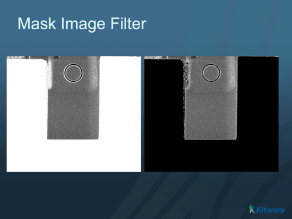

# ITK Mask Image Filter

Masks an image using a second mask image.

## Group (Subgroup)

ITKImageIntensity (ImageIntensity)

## Description

This filter combines an input image with a mask image of the same size. For each pixel, if the corresponding mask pixel is non-zero (foreground), the input pixel value is copied to the output. If the mask pixel is zero (background), the *Outside Value* is written to the output instead.

The input image and the mask image must have the same dimensions.

### Parameter Guidance

**Outside Value** is the value written to the output wherever the mask pixel equals 0. It defaults to 0. This value is interpreted in the intensity units of the image data.

% Auto generated parameter table will be inserted here

## References

[1] T.S. Yoo, M. J. Ackerman, W. E. Lorensen, W. Schroeder, V. Chalana, S. Aylward, D. Metaxas, R. Whitaker. Engineering and Algorithm Design for an Image Processing API: A Technical Report on ITK - The Insight Toolkit. In Proc. of Medicine Meets Virtual Reality, J. Westwood, ed., IOS Press Amsterdam pp 586-592 (2002).
[2] H. Johnson, M. McCormick, L. Ibanez. The ITK Software Guide: Design and Functionality. Fourth Edition. Published by Kitware Inc. 2015 ISBN: 9781-930934-28-3
[3] H. Johnson, M. McCormick, L. Ibanez. The ITK Software Guide: Introduction and Development Guidelines. Fourth Edition. Published by Kitware Inc. 2015 ISBN: 9781-930934-27-6

## Example Pipelines

## License & Copyright

Please see the description file distributed with this **Plugin**.

## DREAM3D-NX Help

If you need help, need to file a bug report or want to request a new feature, please head over to the [DREAM3DNX-Issues](https://github.com/BlueQuartzSoftware/DREAM3DNX-Issues/discussions) GitHub site where the community of DREAM3D-NX users can help answer your questions.
