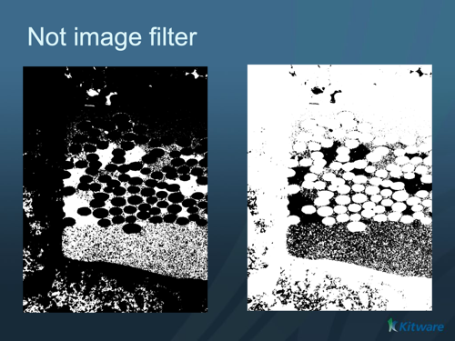

# ITK Not Image Filter

Implements the NOT logical operator pixel-wise on an image.

## Group (Subgroup)

ITKImageIntensity (ImageIntensity)

## Description

Applies the logical NOT operator to each pixel of an integer image. The input must be an integer-valued image. For each pixel, a value equal to 0 is replaced with the Foreground Value, and any non-zero value is replaced with the Background Value. This is commonly used to invert a binary (mask) image.

% Auto generated parameter table will be inserted here

## Example Pipelines

## License & Copyright

Please see the description file distributed with this plugin.

## DREAM3D-NX Help

If you need help, need to file a bug report or want to request a new feature, please head over to the [DREAM3DNX-Issues](https://github.com/BlueQuartzSoftware/DREAM3DNX-Issues/discussions) GitHub site where the community of DREAM3D-NX users can help answer your questions.
