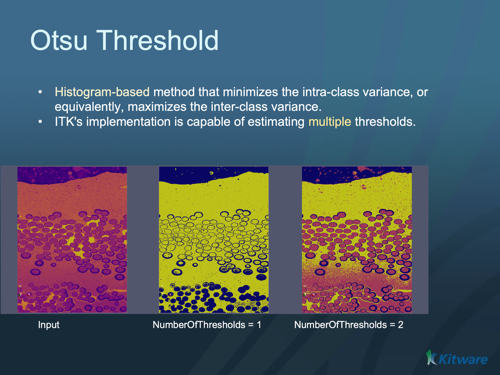

# ITK Otsu Multiple Thresholds Image Filter

Threshold an image using multiple Otsu Thresholds.

## Group (Subgroup)

ITKThresholding (Thresholding)

## Description

This filter creates a labeled image that separates the input image into various classes. The filter computes the thresholds using the OtsuMultipleThresholdsCalculator and applies those thresholds to the input image using the ThresholdLabelerImageFilter . The NumberOfHistogramBins and NumberOfThresholds can be set for the Calculator. The LabelOffset can be set for the ThresholdLabelerImageFilter .

This filter also includes an option to use the valley emphasis algorithm from H.F. Ng, "Automatic thresholding for defect detection", Pattern Recognition Letters, (27): 1644-1649, 2006. The valley emphasis algorithm is particularly effective when the object to be thresholded is small. See the following tests for examples: itkOtsuMultipleThresholdsImageFilterTest3 and itkOtsuMultipleThresholdsImageFilterTest4 To use this algorithm, simple call the setter: SetValleyEmphasis(true) It is turned off by default.* ScalarImageToHistogramGenerator

- OtsuMultipleThresholdsCalculator
- ThresholdLabelerImageFilter

% Auto generated parameter table will be inserted here

## Example Pipelines

## License & Copyright

Please see the description file distributed with this plugin.

## DREAM3D-NX Help

If you need help, need to file a bug report or want to request a new feature, please head over to the [DREAM3DNX-Issues](https://github.com/BlueQuartzSoftware/DREAM3DNX-Issues/discussions) GitHub site where the community of DREAM3D-NX users can help answer your questions.
