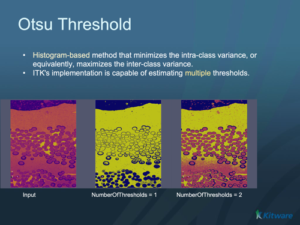

# ITK Otsu Multiple Thresholds Image Filter

Automatically separates an image into several intensity classes using Otsu's method and writes a label map.

## Group (Subgroup)

ITKThresholding (Thresholding)

## Description

**Otsu thresholding** automatically chooses threshold values from the image's intensity histogram — it picks the thresholds that best separate the pixels into distinct classes by maximizing the variance *between* classes (equivalently, minimizing the variance *within* each class). No threshold intensities are entered by hand; the filter computes them for you.

This filter is the multi-level version: instead of one threshold (two classes), it finds **N** thresholds that partition the image into **N + 1** classes. The output is a **label map** in which each pixel is assigned an integer class index (0, 1, 2, …) according to which intensity band it falls into.

Use this filter when an image contains several distinguishable intensity populations (for example background, matrix, and one or more phases) and you want them segmented into labels without manually tuning cutoffs.

### Parameter Guidance

- **Number Of Thresholds** — how many thresholds to compute. The output contains one more class than this number (N thresholds → N + 1 labels). Default *1* (two classes).
- **Number Of Histogram Bins** — the number of bins used to build the intensity histogram the thresholds are computed from. More bins give finer threshold resolution at the cost of speed; default *128*.
- **Label Offset** — an integer added to every output label so the classes start from a value other than 0 (useful for keeping labels distinct from other label maps). Default *0*.
- **Valley Emphasis** — when on, biases the threshold selection toward the valleys (low-population dips) of the histogram. This helps when the object of interest is small and would otherwise be lost against a large background population. Default *off*.
- **ReturnBinMidpoint** — when on, each computed threshold is reported as the midpoint of its histogram bin; when off (default), the bin's maximum value is used.

### Required Input Sources

Operates on any scalar image — typically from [Read Image](../SimplnxCore/ReadImageFilter.md), [Read Images [3D Stack]](../SimplnxCore/ReadImageStackFilter.md), or the output of a prior ITK image filter.

% Auto generated parameter table will be inserted here

## Example Pipelines

## License & Copyright

Please see the description file distributed with this **Plugin**

## DREAM3D-NX Help

If you need help, need to file a bug report or want to request a new feature, please head over to the [DREAM3DNX-Issues](https://github.com/BlueQuartzSoftware/DREAM3DNX-Issues/discussions) GitHub site where the community of DREAM3D-NX users can help answer your questions.
