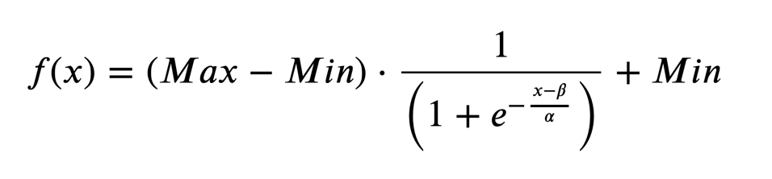

# ITK Sigmoid Image Filter

Computes the sigmoid function pixel-wise.

## Group (Subgroup)

ITKImageIntensity (ImageIntensity)

## Description

A linear transformation is applied first on the argument of the sigmoid function. The resulting total transform is given by

Every output pixel is equal to f(x). Where x is the intensity of the homologous input pixel, and alpha and beta are user-provided constants.

% Auto generated parameter table will be inserted here

## Example Pipelines

## License & Copyright

Please see the description file distributed with this plugin.

## DREAM3D-NX Help

If you need help, need to file a bug report or want to request a new feature, please head over to the [DREAM3DNX-Issues](https://github.com/BlueQuartzSoftware/DREAM3DNX-Issues/discussions) GitHub site where the community of DREAM3D-NX users can help answer your questions.
