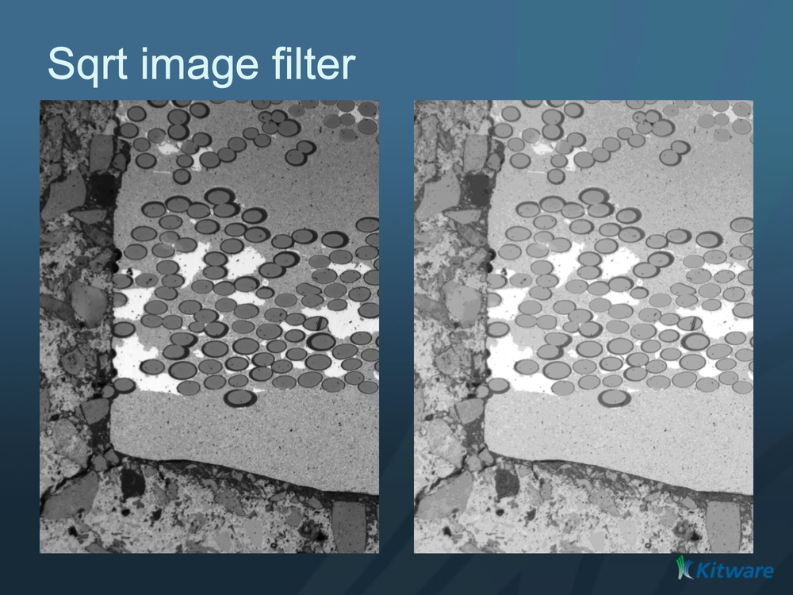

# ITK Sqrt Image Filter

Computes the square root of each pixel.

## Group (Subgroup)

ITKImageIntensity (ImageIntensity)

## Description

Replaces each pixel value with its square root. The input image should contain only non-negative values, since the square root of a negative number is undefined. Pixel values are in image intensity units.

% Auto generated parameter table will be inserted here

## Example Pipelines

## License & Copyright

Please see the description file distributed with this plugin.

## DREAM3D-NX Help

If you need help, need to file a bug report or want to request a new feature, please head over to the [DREAM3DNX-Issues](https://github.com/BlueQuartzSoftware/DREAM3DNX-Issues/discussions) GitHub site where the community of DREAM3D-NX users can help answer your questions.
